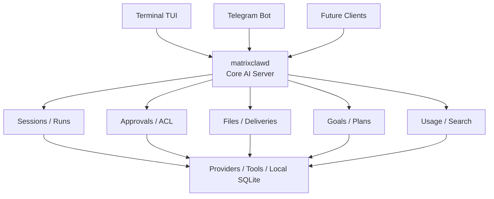
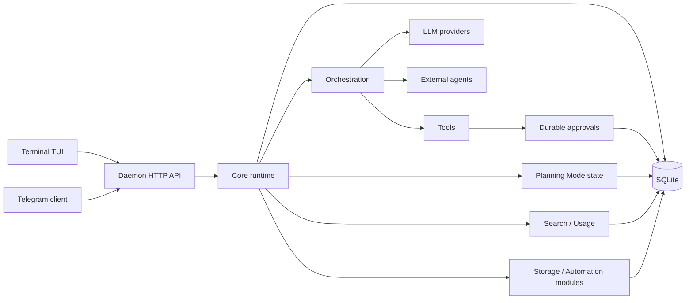

# matrixclaw


**Open-source personal AI infrastructure that runs locally and follows you
across clients.**

`matrixclaw` is a personal AI assistant runtime written in Go. It runs as a
small local daemon, stores state in SQLite, and gives your AI sessions a home
outside any single app or chat window.

The core owns the session: context, files, tool history, approvals, provider
settings, model choice, usage records, goals/plans, searchable history, and
optional external-agent attachments. The Terminal TUI, Telegram bot, and future
mobile clients are only interfaces connected to the same local runtime.

That means you can start a conversation in the terminal, approve a tool call on
your machine, continue from Telegram, and later return to the same session
without losing the thread.

`matrixclaw` is built for personal work first: development, research, files,
remote checks, reminders, provider switching, visible task plans, and future
agent workflows where continuity and explicit control matter.

<p align="center">
  
</p>

## Why matrixclaw?

- **Small Go daemon:** about 10 MB RAM while idle on the current Linux server,
  with exact usage depending on OS, build, and active clients.
- **One assistant, many clients:** begin a session in Terminal TUI and continue it in Telegram.
- **Local-first state:** sessions, runs, approvals, files, plans, usage, and provider choices live in SQLite.
- **Provider switching:** OpenAI-compatible APIs, OpenAI Codex subscription OAuth, Anthropic, Gemini, and custom endpoints.
- **External agents:** experimental Codex app-server sessions attach to the same session model.
- **Tools with approvals:** file and shell tools pause before risky changes.
- **Planning Mode:** persistent goals, tasks, subtasks, resumable execution, and a core-owned runner.
- **Search and usage:** session history is searchable, and provider token usage is recorded when available.
- **Storage module:** Telegram uploads and generated files land in local storage, with temporary files promoted only when needed.
- **Local voice modules:** Piper and Supertonic TTS plus Whisper.cpp STT run locally, either per task to save RAM or as managed warm processes.
- **Automation-ready:** reminders, scheduled AI tasks, deliveries, and future agent workflows.

## Daemon-first Architecture

`matrixclaw` is daemon-first, not UI-first. The daemon owns the durable session,
the SQLite database, approvals, runs, storage, modules, automation, and external
agent attachments. Clients render state and send commands.

This keeps the Terminal TUI and Telegram bot small:

- exiting the TUI does not end the session
- restarting Telegram does not lose history or approvals
- provider/model choices and permissions stay attached to the session
- local voice and storage modules are selected once and reused by all clients
- external agents can attach to a matrixclaw session without becoming normal LLM providers

The daemon is also the memory boundary. Idle matrixclaw stays small, while
optional heavy work such as Whisper.cpp can run only for the current request
unless you explicitly choose an always-running local process.

## Session handoff: terminal to Telegram and back

Most AI tools keep the real conversation inside one UI process. That makes every
other client feel like a separate product.

`matrixclaw` keeps the session in the daemon instead. The Terminal TUI and
Telegram bot are just clients connected to the same local runtime.



A typical flow:

1. Start a session in `matrixclaw tui`.
2. Ask the assistant to inspect files or prepare a change.
3. Review and approve tool actions from the terminal.
4. Leave your machine and continue the same session in Telegram.
5. Come back later and pick up the session in the TUI with the same context and history.

The goal is not to replace your editor or host your work in the cloud. The goal
is to give your own machine a small, durable AI operator that can be reached
from more than one surface.

## Install

Install the latest release:

```bash
curl -fsSL https://raw.githubusercontent.com/Suren878/matrixclaw/main/scripts/install.sh | bash
```

The installer downloads the matching GitHub Release archive, installs
`matrixclaw` and `matrixclawd` into `~/.local/bin`, prepares local config/state
directories, and starts `matrixclaw setup`.

Local TTS/STT runtimes are optional because they install extra system packages
and build native binaries. To prepare Piper, Supertonic, Whisper.cpp, and
`ffmpeg` during install:

```bash
curl -fsSL https://raw.githubusercontent.com/Suren878/matrixclaw/main/scripts/install.sh | bash -s -- --voice-runtime
```

You can also install them later:

```bash
curl -fsSL https://raw.githubusercontent.com/Suren878/matrixclaw/main/scripts/install_voice_runtime.sh | bash
```

On systems where packages are managed separately, install `git`, `cmake`, a C++
compiler, Python 3 with venv support, and `ffmpeg`, then run:

```bash
scripts/install_voice_runtime.sh --no-system-deps
```

The voice runtime installer prepares local binaries only. Voices and STT models
are selected and downloaded later from the module UI, so an open-source install
can stay small until you choose local audio features.

After setup is saved, run `matrixclaw` to open the terminal TUI. On a fresh
machine, plain `matrixclaw` opens setup first and opens the TUI on later runs.

When the TUI starts, it checks the latest GitHub Release. If a newer version is
available, it asks before updating. A successful TUI update then asks whether to
restart the daemon so the background service uses the new binary.

Manual update:

```bash
matrixclaw update install
matrixclaw service restart
```

Uninstall keeps config and state by default:

```bash
curl -fsSL https://raw.githubusercontent.com/Suren878/matrixclaw/main/scripts/uninstall.sh | bash
```

Remove config and state explicitly:

```bash
curl -fsSL https://raw.githubusercontent.com/Suren878/matrixclaw/main/scripts/uninstall.sh | bash -s -- --purge
```

## What It Does

- Terminal setup and chat TUI for local operator work.
- Telegram client for remote sessions, files, images, provider/model commands, and approvals.
- Durable sessions, messages, runs, approvals, file snapshots, deliveries, and tool results.
- OpenAI-compatible, OpenAI Codex subscription OAuth, Anthropic-compatible, Gemini, and custom provider adapters.
- Experimental external-agent sessions through Codex app-server.
- Service-owned tool execution with approval previews before writes and shell actions.
- Planning Mode for multi-step work, with persistent tasks/subtasks, resumable execution, model-facing `plan_*` tools, and manual `/plan` commands.
- Token usage ledger from provider finish metadata, surfaced in the TUI header and `/usage`.
- SQLite-backed message search through `/search`.
- Local storage module for temporary uploads, stored files, imports, previews, promotion, deletion, and cleanup settings.
- Telegram image/document uploads stored as temporary files, with explicit save/delete controls.
- Telegram voice and audio messages transcribed through the configured STT provider and sent into the active session as text.
- Telegram `/tts` and assistant `text_to_speech` tool results sent back as voice messages and archived in storage.
- SQLite-backed local state with reconnectable clients and session handoff.
- Automation jobs for reminders and scheduled AI tasks.

## Planning Mode

Planning Mode turns a loose multi-step request into durable session work. A plan
has a goal, top-level tasks, optional subtasks, and explicit item statuses:
`pending`, `active`, `done`, and `skipped`.

The TUI shows the plan in a side panel with tree rendering for subtasks. You can
create and edit tasks manually, or let the assistant create/update the plan
through safe plan tools.

Execution is owned by the core runtime:

- The daemon stores plan state in SQLite.
- A persisted plan runner checkpoints the current item, last run, attempts, and status.
- Parent tasks with open subtasks are treated as sections, not executable work.
- The runner selects the next executable leaf item and runs one item at a time.
- On successful completion, core closes the item and auto-closes parent sections when all children are terminal.
- If the model reports a blocked step, the runner records the blocked state instead of marking it done.
- If the TUI or daemon restarts, unfinished plans can be resumed from stored state.

This keeps the model from being the source of truth for whether the plan is
complete. The model performs the current task; the daemon owns the workflow
state.

See [Planning Mode](docs/PLANNING.md) for the implementation model and edge
cases.

## Commands

```text
matrixclaw                  open TUI when configured, otherwise setup
matrixclaw setup            open setup
matrixclaw status           print setup and service state
matrixclaw doctor           diagnose setup, daemon, and providers
matrixclaw version          print client and daemon build info
matrixclaw update           check for and install newer releases
matrixclaw providers        list setup provider catalog
matrixclaw providers login openai-codex
matrixclaw providers verify verify configured provider model access
matrixclaw agents           list external agent runtimes
matrixclaw agents start     create an external agent session
matrixclaw service status   print service state
matrixclaw service restart  restart service
matrixclaw service stop     stop service
matrixclaw service logs     print recent service logs
matrixclaw tui [WORKDIR]    open terminal chat for the current or given directory
matrixclawd                 service binary used by systemd/direct launch
```

The setup file is the configured marker. First run `matrixclaw` or explicit
`matrixclaw setup` writes it; later `matrixclaw` starts the daemon when needed
and opens the terminal TUI. Exiting the TUI closes only the terminal client, not
the background daemon.

Commands that read setup report missing or unsupported setup on stderr and exit
nonzero. Use `matrixclaw setup` to recreate setup explicitly.

OpenAI Codex Subscription uses ChatGPT/Codex OAuth instead of an API key. Select
`OpenAI Codex Subscription` in setup, authorize with:

```bash
matrixclaw providers login openai-codex
```

Then open the provider's `Model` picker. Matrixclaw loads the available Codex
models from the Codex backend and stores the chosen model like any other session
provider.

## In-session controls

The Terminal TUI and Telegram client share the same control-plane commands, so a
command that changes session state in one client is visible from the other.
These are client commands, not model tools.

```text
/new                         create a session
/sessions                    list, select, rename, or delete sessions
/provider                    select provider/model for the current session
/permissions                 change the current session permission mode
/context                     inspect compacted context and token estimate
/usage                       show recorded input/output/reasoning/cached tokens
/plan                        show Planning Mode
/plan goal <text>            set the session goal
/plan add <text>             add a plan item
/plan subtask <n> <text>     add a subtask under an item
/plan edit <n> <text>        edit a plan item
/plan active|done|skip <n>   update a plan item by number
/plan clear                  clear Planning Mode after confirmation
/search <query>              search stored message history
/modules storage             manage local stored and temporary files
/modules tts                 manage Text to Speech providers and voices
/modules stt                 manage Speech to Text providers and models
/modules agents              enable or disable external agent runtimes
/remind                      create a one-time reminder
/tasks                       list and manage scheduled AI tasks
/server, /status, /restart, /stop   inspect, restart, or stop the local service
```

For multi-step user requests, the assistant also receives safe plan tools:
`plan_get`, `plan_set_goal`, `plan_add_item`, `plan_update_item`, and
`plan_clear`. These update the same session plan that manual commands display.

## From Source

Prerequisites:

- Go 1.26+
- Linux or another Unix-like development environment
- Optional: systemd user services for autostart

```bash
git clone https://github.com/Suren878/matrixclaw.git
cd matrixclaw

go test ./...
go vet ./...

mkdir -p ./bin
go build -o ./bin/matrixclaw ./cmd/matrixclaw
go build -o ./bin/matrixclawd ./cmd/matrixclawd

./bin/matrixclaw
```

For a local source install:

```bash
./scripts/install.sh --from-source
```

Release builds can stamp version metadata:

```bash
./scripts/build_release.sh
```

## Architecture



Core rules:

- clients render state; they do not own runtime truth
- command semantics live in `internal/controlplane`
- all real work becomes a persisted run
- tool approvals are durable and restart-safe
- provider and model selection are session data
- Planning Mode state and plan-run checkpoints are session data
- search and token usage are read-only views over local SQLite state
- storage, voice, and external agents are daemon modules behind the same local API
- orchestration, providers, and tools are replaceable adapter families

## External Agents

External agents are optional runtimes attached to matrixclaw sessions. They are
not normal LLM providers. matrixclaw still owns the session, local history,
client handoff, and normalized event display; the external agent owns its own
thread or process protocol.

Current built-in runtime:

- Codex app-server, detected from the `codex` binary.

Manage them from the TUI:

```text
/modules -> External Agents
```

The screen shows installed/enabled state, mode, resolved binary path, and
version when available. Enabling Codex adds it to the New Session picker.
Codex options use the same shared controls as the rest of the TUI: `Path` opens
the standard text prompt, and `Enabled` opens a small Enable/Disable picker.

## Local Voice

Text to Speech supports Piper and Supertonic 3 as local providers.
Speech to Text supports Whisper.cpp as a local provider. Voice models are
downloaded from the module UI, while the local runtime binaries are prepared by:

```bash
scripts/install_voice_runtime.sh
```

The script installs/updates:

- Piper in `~/.local/state/matrixclaw/runtime/piper-venv`
- Supertonic in `~/.local/state/matrixclaw/runtime/supertonic-venv`
- Whisper.cpp CLI and server in `~/.local/state/matrixclaw/runtime/whisper.cpp`
- `ffmpeg` for STT input conversion and local TTS MP3 output

Voice is part of the same daemon-first architecture as sessions and storage.
Clients request speech through the daemon API, the daemon selects the active
module/provider/model, and Terminal plus Telegram use the same module state.
Generated Telegram TTS audio is saved into Storage under `telegram/audio/`.

The TUI exposes voice as normal modules:

```text
/modules -> Text to Speech
/modules -> Speech to Text
```

Each module has a provider picker, provider setup, and a status screen. The
provider picker selects what the assistant should use; setup installs engines,
downloads voices/models, chooses language/model/voice, and selects runtime mode.

Local providers support two runtime modes:

- **Run per task:** default mode for Piper, Supertonic, and
  Whisper.cpp. The native runtime starts only for the current TTS/STT job, then
  exits. This keeps idle memory near zero and is the best default for laptops
  and small servers. Whisper.cpp still needs RAM while a transcription is
  running; the selected model size controls that peak.
- **Always running:** keeps a managed local process warm for lower startup
  latency. Piper uses the local Piper process manager, Supertonic uses
  `supertonic serve` on loopback, and Whisper.cpp uses `whisper-server` with
  the local `/inference` endpoint.

Piper voices are fetched from the online Piper voice catalog when available,
with bundled English and Russian fallbacks. The setup flow is:

```text
/modules -> Text to Speech -> Setup Provider -> Piper
```

Choose `Engine` to install or delete the managed `piper-tts` runtime. Then open
`Voice`, choose `Add Voice`, pick a language, download a voice, and make it the
active voice. Piper engine installation and voice downloads stay separate so a
small open-source install does not pull every voice by default. The status
screen reports local model storage, runtime mode, and current process RAM.

Supertonic 3 is the heavier local TTS option. Its `Runtime` row installs the
Python SDK with local server support and runs the official `supertonic download`
command for the shared model. Voice styles M1-M5/F1-F5 are selected without
separate per-voice downloads, and language can stay on `Auto` or be pinned to
one of Supertonic's 31 supported language codes. In `Always running` mode,
matrixclaw keeps `supertonic serve` on loopback and sends TTS requests to that
local API. Supertonic can encode WAV, FLAC, and OGG/Vorbis natively; Matrixclaw
converts local TTS output to MP3 through `ffmpeg` before returning it to clients.
The temporary WAV files produced by local runtimes are removed immediately after
the daemon reads them.

Whisper.cpp models are fetched from the upstream Whisper.cpp model catalog when
available, with bundled size tiers from `tiny` through `large-v3`. If the
Whisper engine is not installed yet, choosing a model can build the engine and
download the model in one flow. Language is `Auto` by default, and the TUI
exposes Whisper's supported language codes from Afrikaans through Chinese
instead of hard-coding only English/Russian:

```text
/modules -> Speech to Text -> Setup Provider -> Whisper.cpp
```

Open `Model`, download a model size, select the active model, then leave
language on `Auto` or pin a specific spoken language. `Run Per Task` starts
`whisper-cli` only for the current transcription; `Always Running` keeps
`whisper-server` warm on loopback. The status screen reports local model storage
and current process RAM.

The STT API accepts voice JSON bodies up to 36 MB, which is roughly 25 MB of raw
audio after base64 overhead.

See [Local Voice](docs/VOICE.md) and [Storage and Telegram Files](docs/STORAGE.md)
for the local model paths, run modes, temporary-file lifecycle, and Telegram
voice/file flow.

## Repository Map

- [`cmd/matrixclaw`](cmd/matrixclaw): operator CLI and terminal entrypoint
- [`cmd/matrixclawd`](cmd/matrixclawd): daemon composition root
- [`clients/terminal`](clients/terminal): setup UI, terminal chat, widgets
- [`clients/telegram`](clients/telegram): Telegram Bot API client
- [`internal/core`](internal/core): sessions, runs, approvals, messages, events
- [`internal/api`](internal/api): local HTTP API
- [`internal/controlplane`](internal/controlplane): shared command surface
- [`internal/store`](internal/store): SQLite persistence
- [`internal/providers`](internal/providers): provider adapters and catalog
- [`internal/externalagents`](internal/externalagents): external-agent registry and Codex app-server adapter
- [`internal/tools`](internal/tools): builtin tools
- [`docs`](docs): planning, local voice, and storage notes
- [`scripts`](scripts): install, uninstall, and release-build scripts
- [`packaging`](packaging): release and Homebrew packaging notes
- [`tests`](tests): contract and integration test suites

## Privacy And Security

Local by default:

- SQLite sessions, messages, runs, approvals, file snapshots, and bindings.
- Provider setup metadata.
- Tool approvals and execution records.
- Local file reads, writes, and diffs before provider calls.

Can leave your machine:

- Prompts, selected context, tool results, and conversation history sent to the configured LLM provider.
- External-agent prompts, working directories, and agent events sent through the configured external agent.
- Telegram messages and buttons when the Telegram client is enabled.
- Network traffic caused by tools you approve or run.
- Any custom provider endpoint you configure.

The daemon API is intended for local clients. By default `matrixclawd` refuses
non-loopback HTTP binds unless `MATRIXCLAW_ALLOW_REMOTE_HTTP=1` is explicitly
set.

See [SECURITY.md](SECURITY.md) for security reporting and local-secret notes.

## Status

`matrixclaw` is an early single-user local operator. It is a good fit for local
developer machines, terminal-first usage, Telegram as a remote companion client,
and experimenting with provider/tool orchestration without rewriting clients.

It is not currently a hosted multi-tenant service, browser IDE replacement, or
distributed worker platform.

## License

MIT. See [LICENSE](LICENSE).
