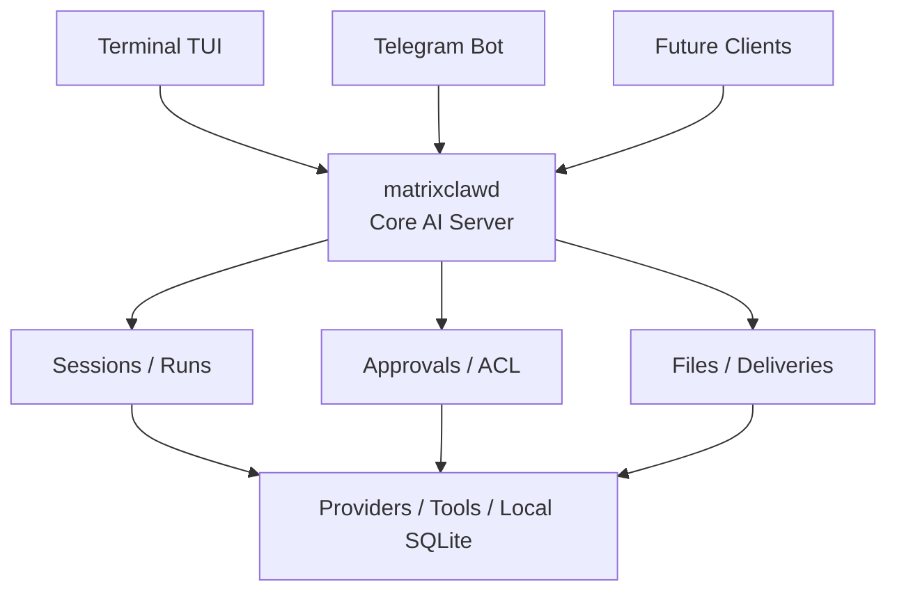
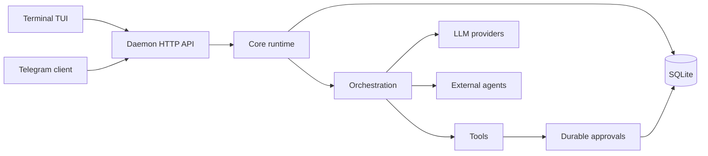

# matrixclaw


**Open-source personal AI infrastructure that runs locally and follows you
across clients.**

`matrixclaw` is a personal AI assistant runtime written in Go. It runs as a
small local daemon, stores state in SQLite, and gives your AI sessions a home
outside any single app or chat window.

The core owns the session: context, files, tool history, approvals, provider
settings, model choice, and optional external-agent attachments. The Terminal
TUI, Telegram bot, and future mobile clients are only interfaces connected to
the same local runtime.

That means you can start a conversation in the terminal, approve a tool call on
your machine, continue from Telegram, and later return to the same session
without losing the thread.

`matrixclaw` is built for personal work first: development, research, files,
remote checks, reminders, provider switching, and future agent workflows where
continuity and explicit control matter.

<p align="center">
  
</p>

## Why matrixclaw?

- **Small Go daemon:** about 10 MB RAM while idle on the current Linux server,
  with exact usage depending on OS, build, and active clients.
- **One assistant, many clients:** begin a session in Terminal TUI and continue it in Telegram.
- **Local-first state:** sessions, runs, approvals, files, and provider choices live in SQLite.
- **Provider switching:** OpenAI-compatible APIs, Anthropic, Gemini, and custom endpoints.
- **External agents:** experimental Codex app-server sessions attach to the same session model.
- **Tools with approvals:** file and shell tools pause before risky changes.
- **Automation-ready:** reminders, scheduled AI tasks, deliveries, and future agent workflows.

## Session handoff: terminal to Telegram and back

Most AI tools keep the real conversation inside one UI process. That makes every
other client feel like a separate product.

`matrixclaw` keeps the session in the daemon instead. The Terminal TUI and
Telegram bot are just clients connected to the same local runtime.



A typical flow:

1. Start a session in `matrixclaw tui`.
2. Ask the assistant to inspect files or prepare a change.
3. Review and approve tool actions from the terminal.
4. Leave your machine and continue the same session in Telegram.
5. Come back later and pick up the session in the TUI with the same context and history.

The goal is not to replace your editor or host your work in the cloud. The goal
is to give your own machine a small, durable AI operator that can be reached
from more than one surface.

## Install

Install the latest release:

```bash
curl -fsSL https://raw.githubusercontent.com/Suren878/matrixclaw/main/scripts/install.sh | bash
```

The installer downloads the matching GitHub Release archive, installs
`matrixclaw` and `matrixclawd` into `~/.local/bin`, prepares local config/state
directories, and starts `matrixclaw setup`.

After setup is saved, run `matrixclaw` to open the terminal TUI. On a fresh
machine, plain `matrixclaw` opens setup first and opens the TUI on later runs.

Uninstall keeps config and state by default:

```bash
curl -fsSL https://raw.githubusercontent.com/Suren878/matrixclaw/main/scripts/uninstall.sh | bash
```

Remove config and state explicitly:

```bash
curl -fsSL https://raw.githubusercontent.com/Suren878/matrixclaw/main/scripts/uninstall.sh | bash -s -- --purge
```

## What It Does

- Terminal setup and chat TUI for local operator work.
- Telegram client for remote sessions, files, images, provider/model commands, and approvals.
- Durable sessions, messages, runs, approvals, file snapshots, deliveries, and tool results.
- OpenAI-compatible, Anthropic-compatible, Gemini, and custom provider adapters.
- Experimental external-agent sessions through Codex app-server.
- Service-owned tool execution with approval previews before writes and shell actions.
- SQLite-backed local state with reconnectable clients and session handoff.
- Automation jobs for reminders and scheduled AI tasks.

## Commands

```text
matrixclaw                  open TUI when configured, otherwise setup
matrixclaw setup            open setup
matrixclaw status           print setup and service state
matrixclaw doctor           diagnose setup, daemon, and providers
matrixclaw version          print client and daemon build info
matrixclaw providers        list setup provider catalog
matrixclaw providers verify verify configured provider model access
matrixclaw service status   print service state
matrixclaw service restart  restart service
matrixclaw service logs     print recent service logs
matrixclaw tui [WORKDIR]    open terminal chat for the current or given directory
matrixclawd                 service binary used by systemd/direct launch
```

The setup file is the configured marker. First run `matrixclaw` or explicit
`matrixclaw setup` writes it; later `matrixclaw` starts the daemon when needed
and opens the terminal TUI. Exiting the TUI closes only the terminal client, not
the background daemon.

Commands that read setup report missing or unsupported setup on stderr and exit
nonzero. Use `matrixclaw setup` to recreate setup explicitly.

## From Source

Prerequisites:

- Go 1.26+
- Linux or another Unix-like development environment
- Optional: systemd user services for autostart

```bash
git clone https://github.com/Suren878/matrixclaw.git
cd matrixclaw

go test ./...
go vet ./...

mkdir -p ./bin
go build -o ./bin/matrixclaw ./cmd/matrixclaw
go build -o ./bin/matrixclawd ./cmd/matrixclawd

./bin/matrixclaw
```

For a local source install:

```bash
./scripts/install.sh --from-source
```

Release builds can stamp version metadata:

```bash
./scripts/build_release.sh
```

## Architecture



Core rules:

- clients render state; they do not own runtime truth
- command semantics live in `internal/controlplane`
- all real work becomes a persisted run
- tool approvals are durable and restart-safe
- provider and model selection are session data
- orchestration, providers, and tools are replaceable adapter families

## Repository Map

- [`cmd/matrixclaw`](cmd/matrixclaw): operator CLI and terminal entrypoint
- [`cmd/matrixclawd`](cmd/matrixclawd): daemon composition root
- [`clients/terminal`](clients/terminal): setup UI, terminal chat, widgets
- [`clients/telegram`](clients/telegram): Telegram Bot API client
- [`internal/core`](internal/core): sessions, runs, approvals, messages, events
- [`internal/api`](internal/api): local HTTP API
- [`internal/controlplane`](internal/controlplane): shared command surface
- [`internal/store`](internal/store): SQLite persistence
- [`internal/providers`](internal/providers): provider adapters and catalog
- [`internal/externalagents`](internal/externalagents): external-agent registry and Codex app-server adapter
- [`internal/tools`](internal/tools): builtin tools
- [`scripts`](scripts): install, uninstall, and release-build scripts
- [`packaging`](packaging): release and Homebrew packaging notes
- [`tests`](tests): contract and integration test suites

## Privacy And Security

Local by default:

- SQLite sessions, messages, runs, approvals, file snapshots, and bindings.
- Provider setup metadata.
- Tool approvals and execution records.
- Local file reads, writes, and diffs before provider calls.

Can leave your machine:

- Prompts, selected context, tool results, and conversation history sent to the configured LLM provider.
- External-agent prompts, working directories, and agent events sent through the configured external agent.
- Telegram messages and buttons when the Telegram client is enabled.
- Network traffic caused by tools you approve or run.
- Any custom provider endpoint you configure.

The daemon API is intended for local clients. By default `matrixclawd` refuses
non-loopback HTTP binds unless `MATRIXCLAW_ALLOW_REMOTE_HTTP=1` is explicitly
set.

See [SECURITY.md](SECURITY.md) for security reporting and local-secret notes.

## Status

`matrixclaw` is an early single-user local operator. It is a good fit for local
developer machines, terminal-first usage, Telegram as a remote companion client,
and experimenting with provider/tool orchestration without rewriting clients.

It is not currently a hosted multi-tenant service, browser IDE replacement, or
distributed worker platform.

## License

MIT. See [LICENSE](LICENSE).
