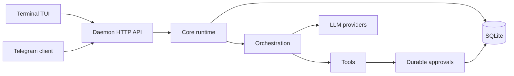

# matrixclaw


<p align="center">
  
</p>

Local daemon-backed AI coding operator for terminal and Telegram.

`matrixclaw` keeps runtime state in one local service. Terminal and Telegram are
thin clients over the same sessions, runs, approvals, provider selection, tool
history, and SQLite store.

```text
terminal TUI       Telegram bot
     |                 |
     v                 v
              matrixclawd
                  |
      sessions / runs / approvals
                  |
       providers / tools / SQLite
```

## Install

Install the latest release:

```bash
curl -fsSL https://raw.githubusercontent.com/Suren878/matrixclaw/main/scripts/install.sh | bash
```

The installer downloads the matching GitHub Release archive, installs
`matrixclaw` and `matrixclawd` into `~/.local/bin`, prepares local config/state
directories, and starts `matrixclaw setup`.

Uninstall keeps config and state by default:

```bash
curl -fsSL https://raw.githubusercontent.com/Suren878/matrixclaw/main/scripts/uninstall.sh | bash
```

Remove config and state explicitly:

```bash
curl -fsSL https://raw.githubusercontent.com/Suren878/matrixclaw/main/scripts/uninstall.sh | bash -s -- --purge
```

## What It Does

- Terminal setup and chat TUI.
- Telegram client for remote sessions, provider/model commands, and approvals.
- Durable sessions, messages, runs, approvals, file snapshots, and tool results.
- OpenAI-compatible, Anthropic-compatible, Gemini, and custom provider adapters.
- Service-owned tool execution and approval flow.
- SQLite-backed local state with reconnectable clients.
- Automation jobs for reminders and scheduled AI tasks.

## Why This Shape?

Most AI coding tools keep runtime truth inside one UI process. That makes
terminal, Telegram, and future clients drift apart.

`matrixclaw` uses a local-service shape instead:

- one runtime owner: `matrixclawd`
- one operator CLI/TUI: `matrixclaw`
- one SQLite-backed source of truth
- one approval path for risky actions
- one provider/model policy per session
- clients render state; they do not own it

## Commands

```text
matrixclaw                  open setup
matrixclaw setup            open setup
matrixclaw status           print setup and service state
matrixclaw doctor           diagnose setup, daemon, and providers
matrixclaw version          print client and daemon build info
matrixclaw providers        list setup provider catalog
matrixclaw providers verify verify configured provider model access
matrixclaw service status   print service state
matrixclaw service restart  restart service
matrixclaw service logs     print recent service logs
matrixclaw tui              open terminal chat
matrixclawd                 service binary used by systemd/direct launch
```

Commands that read setup report missing or unsupported setup on stderr and exit
nonzero. Run `matrixclaw setup` before normal runtime commands.

## From Source

Prerequisites:

- Go 1.26+
- Linux or another Unix-like development environment
- Optional: systemd user services for autostart

```bash
git clone https://github.com/Suren878/matrixclaw.git
cd matrixclaw

go test ./...
go vet ./...

mkdir -p ./bin
go build -o ./bin/matrixclaw ./cmd/matrixclaw
go build -o ./bin/matrixclawd ./cmd/matrixclawd

./bin/matrixclaw setup
./bin/matrixclaw tui
```

For a local source install:

```bash
./scripts/install.sh --from-source
```

Release builds can stamp version metadata:

```bash
./scripts/build_release.sh
```

## Architecture



Core rules:

- clients render state; they do not own runtime truth
- command semantics live in `internal/controlplane`
- all real work becomes a persisted run
- tool approvals are durable and restart-safe
- provider and model selection are session data
- orchestration, providers, and tools are replaceable adapter families

## Repository Map

- [`cmd/matrixclaw`](cmd/matrixclaw): operator CLI and terminal entrypoint
- [`cmd/matrixclawd`](cmd/matrixclawd): daemon composition root
- [`clients/terminal`](clients/terminal): setup UI, terminal chat, widgets
- [`clients/telegram`](clients/telegram): Telegram Bot API client
- [`internal/core`](internal/core): sessions, runs, approvals, messages, events
- [`internal/api`](internal/api): local HTTP API
- [`internal/controlplane`](internal/controlplane): shared command surface
- [`internal/store`](internal/store): SQLite persistence
- [`internal/providers`](internal/providers): provider adapters and catalog
- [`internal/tools`](internal/tools): builtin tools
- [`scripts`](scripts): install, uninstall, and release-build scripts
- [`packaging`](packaging): release and Homebrew packaging notes
- [`tests`](tests): contract and integration test suites

## Privacy And Security

Local by default:

- SQLite sessions, messages, runs, approvals, file snapshots, and bindings.
- Provider setup metadata.
- Tool approvals and execution records.
- Local file reads, writes, and diffs before provider calls.

Can leave your machine:

- Prompts, selected context, tool results, and conversation history sent to the configured LLM provider.
- Telegram messages and buttons when the Telegram client is enabled.
- Network traffic caused by tools you approve or run.
- Any custom provider endpoint you configure.

The daemon API is intended for local clients. By default `matrixclawd` refuses
non-loopback HTTP binds unless `MATRIXCLAW_ALLOW_REMOTE_HTTP=1` is explicitly
set.

See [SECURITY.md](SECURITY.md) for security reporting and local-secret notes.

## Status

`matrixclaw` is an early single-user local operator. It is a good fit for local
developer machines, terminal-first usage, Telegram as a remote companion client,
and experimenting with provider/tool orchestration without rewriting clients.

It is not currently a hosted multi-tenant service, browser IDE replacement, or
distributed worker platform.

## License

MIT. See [LICENSE](LICENSE).
