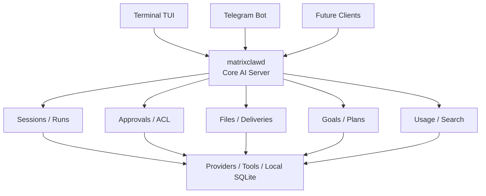

# MatrixClaw


**MatrixClaw is an always-on local AI assistant and AI coding agent runtime for
Terminal and Telegram.**

MatrixClaw is an open-source, local-first OpenClaw alternative for users who
want a self-hosted personal AI operator with durable sessions, SQLite memory,
MCP tools, approvals, scheduled tasks, and Claude Code / Codex subagents.

Start a task in the terminal, continue from Telegram, approve tool calls
remotely, and return later without losing the session.

`matrixclaw` is written in Go and runs as a small local daemon. It stores state
in SQLite and gives your AI sessions a durable home outside any single app or
chat window.

The core owns the session: context, files, tool history, approvals, provider
settings, model choice, usage records, goals/plans, persistent memory,
searchable history, and optional external-agent attachments. The Terminal TUI,
Telegram bot, and future mobile clients are only interfaces connected to the
same local runtime.

`matrixclaw` is built for personal work first: development, research, files,
remote checks, reminders, provider switching, visible task plans, memory,
subagents, and agent workflows where continuity and explicit control matter.

It is useful if you want a self-hosted or local-first AI assistant that can keep
state across clients, run approved tools, switch between LLM providers, delegate
focused tasks to MatrixClaw/Codex/Claude Code subagents, and expose the same
runtime through Terminal, Telegram, or MCP.

<p align="center">
  
</p>

## Why matrixclaw?

- **Small Go daemon:** about 26 MiB RAM while idle on the current Linux server,
  with exact usage depending on OS, build, and active clients.
- **One assistant, many clients:** begin a session in Terminal TUI and continue it in Telegram.
- **Local-first state:** sessions, runs, approvals, files, plans, usage, and provider choices live in SQLite.
- **Provider switching:** OpenAI-compatible APIs, OpenAI Codex subscription OAuth, Anthropic, Gemini, Chinese provider presets, and custom endpoints.
- **External agents:** Codex app-server and Claude Code sessions attach to the same session model.
- **Subagents:** MatrixClaw sessions can delegate bounded tasks to hidden child
  runs through `delegate_task`, including MatrixClaw, Codex, or Claude Code runtimes.
- **Tools with approvals:** file and shell tools pause before risky changes.
- **Planning Mode:** persistent goals, tasks, subtasks, resumable execution, and a core-owned runner.
- **Memory and search:** the assistant can save approved durable memories and search previous sessions with `memory` and `session_search`.
- **Usage ledger:** provider token usage is recorded when available.
- **Storage module:** Telegram uploads and generated files land in local storage, with temporary files promoted only when needed.
- **Web research and browser tools:** `web_research`, `web_research_ask`, and compatibility `web_search` / `web_fetch` tools with SQLite-backed facts/sources and runtime artifacts. Search providers: DuckDuckGo (free, no key), Tavily (1 000 req/mo free), Serper (2 500 req/mo free), SearXNG (self-hosted). Configure from `/modules` without restarting. When an MCP browser server is connected, MatrixClaw can also expose interactive browser tools for opening pages, clicking, typing, waiting, and screenshots.
- **Voice modules:** Piper and Supertonic TTS plus Whisper.cpp STT run locally.
  Realtime speech-to-speech is available through the daemon WebSocket gateway
  with Gemini Live and Grok Voice providers, and an optional telephony gateway
  can bridge Asterisk/SIP calls into the same realtime layer.
- **MCP module:** connect external MCP servers as assistant tools, or expose matrixclaw tools to MCP hosts.
- **Automation-ready:** reminders, scheduled AI tasks, deliveries, and future agent workflows.

## Common Use Cases

- Run a local-first AI assistant with durable sessions, tool history, approvals,
  memory, and searchable context.
- Use a terminal AI TUI that can hand the same session to Telegram without
  losing state.
- Compare or switch between OpenAI-compatible APIs, Codex subscription OAuth,
  Anthropic-compatible models, Gemini, and custom providers.
- Delegate bounded work to native MatrixClaw subagents or external Codex and
  Claude Code subagents.
- Connect MCP servers as assistant tools, or expose MatrixClaw tools to other
  MCP hosts.
- Keep personal AI automation, scheduled tasks, voice, telephony gateway
  configuration, storage, and provider usage in one local SQLite-backed runtime.

## OpenClaw, Claude Code, Codex, and OpenCode alternative

MatrixClaw is not just another terminal AI coding agent.

OpenClaw focuses on self-hosted personal AI assistance across chat apps. Claude
Code, Codex, and OpenCode focus on coding-agent workflows in the terminal or
developer environment.

MatrixClaw sits between them: an always-on local AI operator with a daemon,
Terminal TUI, Telegram client, durable SQLite sessions, MCP tools, approvals,
scheduled tasks, memory, and Claude Code / Codex subagents.

Use MatrixClaw if you want:

- an OpenClaw alternative with Terminal and Telegram access
- a Claude Code or Codex companion that can orchestrate subagents
- an OpenCode alternative focused on persistent sessions and automation
- a local-first AI agent with SQLite memory and approvals
- a self-hosted personal AI assistant that stays running between sessions

## Daemon-first Architecture

`matrixclaw` is daemon-first, not UI-first. The daemon owns the durable session,
the SQLite database, approvals, runs, storage, modules, automation, and external
agent attachments. Clients render state and send commands.

This keeps the Terminal TUI and Telegram bot small:

- exiting the TUI does not end the session
- restarting Telegram does not lose history or approvals
- provider/model choices and permissions stay attached to the session
- local voice and storage modules are selected once and reused by all clients
- MCP tools connect once in the daemon and flow through the same approval system
- external agents can attach to a matrixclaw session without becoming normal LLM providers

The daemon is also the memory boundary. Idle matrixclaw stays small, while
optional heavy work such as Whisper.cpp can run only for the current request
unless you explicitly choose an always-running local process.

## Session handoff: terminal to Telegram and back

Most AI tools keep the real conversation inside one UI process. That makes every
other client feel like a separate product.

`matrixclaw` keeps the session in the daemon instead. The Terminal TUI and
Telegram bot are just clients connected to the same local runtime.



A typical flow:

1. Start a session in `matrixclaw tui`.
2. Ask the assistant to inspect files or prepare a change.
3. Review and approve tool actions from the terminal.
4. Leave your machine and continue the same session in Telegram.
5. Come back later and pick up the session in the TUI with the same context and history.

The goal is not to replace your editor or host your work in the cloud. The goal
is to give your own machine a small, durable AI operator that can be reached
from more than one surface.

## What's New

Latest release highlights for `v0.1.16`:

- Added provider-neutral realtime voice setup for Gemini Live and Grok Voice,
  with API key validation, real model/voice/language controls, and
  provider-specific status in the control plane.
- Added xAI Grok Voice Agent support for speech-to-speech sessions, including
  language hints, manual audio turn commits, tool-call routing, and cleaner
  transcript handling.
- Refactored control-plane menu navigation so Back and Close return to the
  parent surface consistently across menus, pickers, status views, and action
  dialogs.
- Added the optional `matrixclaw-telephony-gateway` binary for self-hosted
  Asterisk/SIP deployments, bridging ARI `externalMedia` RTP audio into
  MatrixClaw realtime voice sessions.
- Added approval-gated `telephony_call` tooling, outbound call objectives,
  inbound caller allowlists, phone-specific prompts, final call transcripts,
  post-call reports, and temporary MP3 call recording plumbing.
- Improved telephony runtime stability with faster inbound answering, a single
  long-lived ARI app listener, hangup-extension filtering, safer RTP/VAD turn
  handling, and realtime close-race fixes.
- Updated release archives, installer, uninstall script, local release build,
  and Homebrew template to include `matrixclaw-telephony-gateway`.

## Install

Install the latest release:

```bash
curl -fsSL https://raw.githubusercontent.com/Suren878/matrixclaw/main/scripts/install.sh | bash
```

The installer downloads the matching GitHub Release archive, installs
`matrixclaw`, `matrixclawd`, and `matrixclaw-telephony-gateway` into
`~/.local/bin`, prepares local config/state directories, and starts
`matrixclaw setup`.

Local TTS/STT runtimes are optional because they install extra system packages
and build native binaries. To prepare Piper, Supertonic, Whisper.cpp, and
`ffmpeg` during install:

```bash
curl -fsSL https://raw.githubusercontent.com/Suren878/matrixclaw/main/scripts/install.sh | bash -s -- --voice-runtime
```

You can also install them later:

```bash
curl -fsSL https://raw.githubusercontent.com/Suren878/matrixclaw/main/scripts/install_voice_runtime.sh | bash
```

On systems where packages are managed separately, install `git`, `cmake`, a C++
compiler, Python 3 with venv support, and `ffmpeg`, then run:

```bash
scripts/install_voice_runtime.sh --no-system-deps
```

The voice runtime installer prepares local binaries only. Voices and STT models
are selected and downloaded later from the module UI, so an open-source install
can stay small until you choose local audio features.

After setup is saved, run `matrixclaw` to open the terminal TUI. On a fresh
machine, plain `matrixclaw` opens setup first and opens the TUI on later runs.

When the TUI starts, it checks the latest GitHub Release. If a newer version is
available, it asks before updating. A successful TUI update then asks whether to
restart the daemon so the background service uses the new binary.

Manual update:

```bash
matrixclaw update install
matrixclaw service restart
```

Uninstall keeps config and state by default:

```bash
curl -fsSL https://raw.githubusercontent.com/Suren878/matrixclaw/main/scripts/uninstall.sh | bash
```

Remove config and state explicitly:

```bash
curl -fsSL https://raw.githubusercontent.com/Suren878/matrixclaw/main/scripts/uninstall.sh | bash -s -- --purge
```

## What It Does

- Terminal setup and chat TUI for local operator work.
- Telegram client for remote sessions, files, images, provider/model commands, and approvals.
- Durable sessions, messages, runs, approvals, file snapshots, deliveries, and tool results.
- OpenAI-compatible, OpenAI Codex subscription OAuth, Anthropic-compatible, Gemini, and custom provider adapters, including presets such as DeepSeek, Qwen / DashScope, Z.AI / GLM, Kimi, MiniMax, OpenRouter, Vercel AI Gateway, NVIDIA NIM, Hugging Face, NovitaAI, GMI Cloud, StepFun, Ollama Cloud, and Kilo Code.
- Experimental external-agent sessions through Codex app-server.
- Service-owned tool execution with approval previews before writes and shell actions.
- Planning Mode for multi-step work, with persistent tasks/subtasks, resumable execution, model-facing `plan_*` tools, and manual `/plan` commands.
- Token usage ledger from provider finish metadata, surfaced in the TUI header and `/usage`.
- SQLite-backed durable memory and message search through `/memory`, `/search`, and assistant-facing `memory` / `session_search` tools.
- Local storage module for temporary uploads, stored files, imports, previews, promotion, deletion, and cleanup settings.
- Telegram image/document uploads stored as temporary files, with explicit save/delete controls.
- Telegram voice and audio messages transcribed through the configured STT provider and sent into the active session as text.
- Telegram `/tts` and assistant `text_to_speech` tool results sent back as voice messages and archived in storage.
- Realtime speech-to-speech sessions over the daemon API. Gemini Live
  (`gemini_live`) and Grok Voice (`grok_voice`) are available through
  MatrixClaw's provider-neutral realtime protocol, so iOS, web, or SIP gateways
  can attach without speaking provider-specific APIs.
- Experimental telephony gateway preparation for Asterisk/SIP deployments. A
  separate `matrixclaw-telephony-gateway` process bridges Asterisk
  ARI/externalMedia and SIP/PJSIP calls into realtime voice sessions, exposes an
  approval-gated `telephony_call` tool, supports inbound caller allowlists, and
  can save transcripts, post-call reports, and temporary MP3 call recordings.
- Web research tools with compact provider-visible facts/sources, follow-up reuse by `research_id`, runtime artifact storage, provider selection, and per-provider credential storage; provider switch takes effect immediately without a daemon restart.
- MCP client module for stdio and streamable HTTP MCP servers, registering remote tools as matrixclaw tools.
- MCP stdio server mode for exposing matrixclaw daemon tools to external MCP hosts.
- SQLite-backed local state with reconnectable clients and session handoff.
- Automation jobs for reminders and scheduled AI tasks.

## Planning Mode

Planning Mode turns a loose multi-step request into durable session work. A plan
has a goal, top-level tasks, optional subtasks, and explicit item statuses:
`pending`, `active`, `done`, and `skipped`.

The TUI shows the plan in a side panel with tree rendering for subtasks. You can
create and edit tasks manually, or let the assistant create/update the plan
through safe plan tools.

Execution is owned by the core runtime:

- The daemon stores plan state in SQLite.
- A persisted plan runner checkpoints the current item, last run, attempts, and status.
- Parent tasks with open subtasks are treated as sections, not executable work.
- The runner selects the next executable leaf item and runs one item at a time.
- On successful completion, core closes the item and auto-closes parent sections when all children are terminal.
- If the model reports a blocked step, the runner records the blocked state instead of marking it done.
- If the TUI or daemon restarts, unfinished plans can be resumed from stored state.

This keeps the model from being the source of truth for whether the plan is
complete. The model performs the current task; the daemon owns the workflow
state.

See [Planning Mode](docs/PLANNING.md) for the implementation model and edge
cases.

## Commands

```text
matrixclaw                  open TUI when configured, otherwise setup
matrixclaw setup            open setup
matrixclaw status           print setup and service state
matrixclaw doctor           diagnose setup, daemon, and providers
matrixclaw version          print client and daemon build info
matrixclaw update           check for and install newer releases
matrixclaw providers        list setup provider catalog
matrixclaw providers login openai-codex
matrixclaw providers verify verify configured provider model access
matrixclaw providers verify --catalogs
matrixclaw agents           list external agent runtimes
matrixclaw agents start     create an external agent session
matrixclaw mcp serve --session SESSION_ID
matrixclaw service status   print service state
matrixclaw service restart  restart service
matrixclaw service stop     stop service
matrixclaw service logs     print recent service logs
matrixclaw tui [WORKDIR]    open terminal chat for the current or given directory
matrixclawd                 service binary used by systemd/direct launch
```

The setup file is the configured marker. First run `matrixclaw` or explicit
`matrixclaw setup` writes it; later `matrixclaw` starts the daemon when needed
and opens the terminal TUI. Exiting the TUI closes only the terminal client, not
the background daemon.

Commands that read setup report missing or unsupported setup on stderr and exit
nonzero. Use `matrixclaw setup` to recreate setup explicitly.

## MCP

matrixclaw supports the Model Context Protocol as a daemon module.

As an **MCP client**, `matrixclawd` can connect configured MCP servers and
expose their remote tools to the assistant as normal matrixclaw tools. The first
supported transports are stdio command servers and streamable HTTP endpoints.
Remote tools are registered with prefixed IDs such as `mcp_browser_navigate`.

With a browser MCP server such as Playwright enabled, MatrixClaw is not limited
to text search and content extraction. The remote browser actions are registered
as normal tools and can be used by the assistant for interactive page work:

```text
open / navigate URL
click elements
type into fields
wait for page state
take screenshots
read rendered text or DOM snapshots
```

The exact tool IDs depend on the MCP server's own tool names. A browser server
with remote tools named `navigate`, `click`, `type`, `screenshot`, and `wait`
would appear as `mcp_browser_navigate`, `mcp_browser_click`,
`mcp_browser_type`, `mcp_browser_screenshot`, and `mcp_browser_wait`. If the
remote server already prefixes tool names, that prefix is preserved in the final
MatrixClaw tool ID.
Example `setup.json` fragment:


```json
{
  "modules": {
    "mcp": {
      "enabled": true,
      "servers": [
        {
          "id": "browser",
          "enabled": true,
          "transport": "stdio",
          "command": "npx",
          "args": ["-y", "@modelcontextprotocol/server-playwright"],
          "read_only": false
        }
      ]
    }
  }
}
```

As an **MCP server**, matrixclaw can expose its daemon tool registry to an
external MCP host:

```bash
matrixclaw mcp serve --session SESSION_ID --workdir /path/to/project
```

External MCP tools are conservative by default: unless a configured server is
marked `read_only`, its tools are treated as mutation tools and require
matrixclaw approval before execution.

See [MCP Module](docs/MCP.md) for configuration fields, safety rules, and
current protocol limits.

OpenAI Codex Subscription uses ChatGPT/Codex OAuth instead of an API key. Select
`OpenAI Codex Subscription` in setup, authorize with:

```bash
matrixclaw providers login openai-codex
```

Then open the provider's `Model` picker. Matrixclaw loads the available Codex
models from the Codex backend and stores the chosen model like any other session
provider.

Provider presets are backed by a registry in `internal/providers`: each provider
declares its catalog metadata, auth mode, transport, runtime adapter, aliases,
defaults, capabilities, and OpenAI-compatible wire quirks in one place. This
keeps API-key providers, Codex OAuth, Anthropic, Gemini, OpenAI-compatible
gateways, and custom endpoints on the same setup path instead of scattering
provider-specific checks through the UI and runtime adapters. Model pickers load
the provider catalog live when the provider exposes one. If a catalog requires
credentials, the model picker is disabled until an API key or OAuth session is
available. `matrixclaw providers verify --catalogs` checks configured providers
and public catalogs in one pass, reporting whether a model list came from a
configured key, public catalog, or live OAuth/backend catalog.

## In-session controls

The Terminal TUI and Telegram client share the same control-plane commands, so a
command that changes session state in one client is visible from the other.
These are client commands, not model tools.

```text
/new                         create a session
/sessions                    list, select, rename, or delete sessions
/provider                    select provider/model for the current session
/permissions                 change the current session permission mode
/context                     inspect compacted context and token estimate
/usage                       show recorded input/output/reasoning/cached tokens
/memory                      show durable assistant memory
/plan                        show Planning Mode
/plan goal <text>            set the session goal
/plan add <text>             add a plan item
/plan subtask <n> <text>     add a subtask under an item
/plan edit <n> <text>        edit a plan item
/plan active|done|skip <n>   update a plan item by number
/plan clear                  clear Planning Mode after confirmation
/search <query>              search stored message history
/modules storage             manage local stored and temporary files
/modules tts                 manage Text to Speech providers and voices
/modules stt                 manage Speech to Text providers and models
/modules agents              enable or disable external agent runtimes
/remind                      create a one-time reminder
/tasks                       list and manage scheduled AI tasks
/server, /status, /restart, /stop   inspect, restart, or stop the local service
```

For multi-step user requests, the assistant also receives safe plan tools:
`plan_get`, `plan_set_goal`, `plan_add_item`, `plan_update_item`, and
`plan_clear`. These update the same session plan that manual commands display.

The assistant also receives memory tools: `session_search` searches stored
conversation history across sessions, while `memory` can list memories and save,
replace, or remove them after explicit approval. Saved memories are injected into
future provider prompts as a compact `Memory:` block.

## From Source

Prerequisites:

- Go 1.26+
- Linux or another Unix-like development environment
- Optional: systemd user services for autostart

```bash
git clone https://github.com/Suren878/matrixclaw.git
cd matrixclaw

go vet ./...

mkdir -p ./bin
go build -o ./bin/matrixclaw ./cmd/matrixclaw
go build -o ./bin/matrixclawd ./cmd/matrixclawd

./bin/matrixclaw
```

For a local source install:

```bash
./scripts/install.sh --from-source
```

Release builds can stamp version metadata:

```bash
./scripts/build_release.sh
```

## Architecture


Core rules:

- clients render state; they do not own runtime truth
- command semantics live in `internal/controlplane`
- all real work becomes a persisted run
- tool approvals are durable and restart-safe
- provider and model selection are session data
- Planning Mode state and plan-run checkpoints are session data
- search and token usage are read-only views over local SQLite state
- storage, voice, MCP, and external agents are daemon modules behind the same local API
- orchestration, providers, and tools are replaceable adapter families

## External Agents

External agents are optional runtimes attached to matrixclaw sessions. They are
not normal LLM providers. matrixclaw still owns the session, local history,
client handoff, and normalized event display; the external agent owns its own
thread or process protocol.

Current built-in runtimes:

- Codex app-server, detected from the `codex` binary.
- Claude Code CLI, detected from the `claude` binary.

Manage them from the TUI:

```text
/modules -> External Agents
```

The screen shows installed/enabled state, mode, resolved binary path, and
version when available. Enabling Codex or Claude Code adds it to the New
Session picker and makes it available as an external subagent runtime.
External-agent options use the same shared controls as the rest of the TUI:
`Path` opens the standard text prompt, and `Enabled` opens a small
Enable/Disable picker.

## Subagents

MatrixClaw assistant sessions receive a `delegate_task` tool for bounded child
work. The parent model stays in charge of the user-facing session; the child
session is hidden from the normal session list and the parent receives only the
tool result summary.

Subagents can run as native MatrixClaw child sessions or through enabled
external agents. Built-in external subagent runtimes are Codex (`codex`) and
Claude Code (`claude`). The main model sees the current subagent configuration in
its system prompt, including which runtimes are available or disabled, so it can
choose `matrixclaw` automatically when it is the only option or ask which
runtime to use when multiple external subagents are enabled.

The tool accepts:

- `goal` required
- `context` optional
- `runtime`: `matrixclaw`, `codex`, `claude`, or `auto` (`matrixclaw` default)
- `model` optional
- `working_dir` optional

Subagent runs start with an isolated prompt built from the delegated
goal/context. They do not inherit the parent chat history, plan, skills prompt,
or memory prompt. Child MatrixClaw runs use a restricted tool view: no recursive
`delegate_task`, no `memory`, no `plan_*`, no TTS, and no automation/storage/
skills category tools.

If a child run reaches a permission approval, MatrixClaw does not open a
separate user approval flow in this version. The delegated task finishes with a
controlled error summary so the parent can decide what to do next.

## Local Voice

Text to Speech supports Piper and Supertonic 3 as local providers.
Speech to Text supports Whisper.cpp as a local provider. Voice models are
downloaded from the module UI, while the local runtime binaries are prepared by:

```bash
scripts/install_voice_runtime.sh
```

The script installs/updates:

- Piper in `~/.local/state/matrixclaw/runtime/piper-venv`
- Supertonic in `~/.local/state/matrixclaw/runtime/supertonic-venv`
- Whisper.cpp CLI and server in `~/.local/state/matrixclaw/runtime/whisper.cpp`
- `ffmpeg` for STT input conversion and local TTS MP3 output

Voice is part of the same daemon-first architecture as sessions and storage.
Clients request speech through the daemon API, the daemon selects the active
module/provider/model, and Terminal plus Telegram use the same module state.
Generated Telegram TTS audio is saved into Storage under `telegram/audio/`.

The TUI exposes voice as normal modules:

```text
/modules -> Text to Speech
/modules -> Speech to Text
/modules -> Realtime Voice
```

Each module has a provider picker, provider setup, and a status screen. The
provider picker selects what the assistant should use; setup installs engines,
downloads voices/models, chooses language/model/voice, and selects runtime mode.

Local providers support two runtime modes:

- **Run per task:** default mode for Piper, Supertonic, and
  Whisper.cpp. The native runtime starts only for the current TTS/STT job, then
  exits. This keeps idle memory near zero and is the best default for laptops
  and small servers. Whisper.cpp still needs RAM while a transcription is
  running; the selected model size controls that peak.
- **Always running:** keeps a managed local process warm for lower startup
  latency. Piper uses the local Piper process manager, Supertonic uses
  `supertonic serve` on loopback, and Whisper.cpp uses `whisper-server` with
  the local `/inference` endpoint.

Piper voices are fetched from the online Piper voice catalog when available,
with bundled English and Russian fallbacks. The setup flow is:

```text
/modules -> Text to Speech -> Setup Provider -> Piper
```

Choose `Engine` to install or delete the managed `piper-tts` runtime. Then open
`Voice`, choose `Add Voice`, pick a language, download a voice, and make it the
active voice. Piper engine installation and voice downloads stay separate so a
small open-source install does not pull every voice by default. The status
screen reports local model storage, runtime mode, and current process RAM.

Supertonic 3 is the heavier local TTS option. Its `Runtime` row installs the
Python SDK with local server support and runs the official `supertonic download`
command for the shared model. Voice styles M1-M5/F1-F5 are selected without
separate per-voice downloads, and language can stay on `Auto` or be pinned to
one of Supertonic's 31 supported language codes. In `Always running` mode,
matrixclaw keeps `supertonic serve` on loopback and sends TTS requests to that
local API. Supertonic can encode WAV, FLAC, and OGG/Vorbis natively; Matrixclaw
converts local TTS output to MP3 through `ffmpeg` before returning it to clients.
The temporary WAV files produced by local runtimes are removed immediately after
the daemon reads them.

Whisper.cpp models are fetched from the upstream Whisper.cpp model catalog when
available, with bundled size tiers from `tiny` through `large-v3`. If the
Whisper engine is not installed yet, choosing a model can build the engine and
download the model in one flow. Language is `Auto` by default, and the TUI
exposes Whisper's supported language codes from Afrikaans through Chinese
instead of hard-coding only English/Russian:

```text
/modules -> Speech to Text -> Setup Provider -> Whisper.cpp
```

Open `Model`, download a model size, select the active model, then leave
language on `Auto` or pin a specific spoken language. `Run Per Task` starts
`whisper-cli` only for the current transcription; `Always Running` keeps
`whisper-server` warm on loopback. The status screen reports local model storage
and current process RAM.

The STT API accepts voice JSON bodies up to 36 MB, which is roughly 25 MB of raw
audio after base64 overhead.

## Realtime Speech-to-Speech

MatrixClaw also has a daemon-level realtime voice gateway for live
speech-to-speech sessions. This is separate from the batch TTS/STT endpoints:
clients create a realtime session, open a WebSocket, stream input audio frames,
and receive assistant audio, transcripts, turn-final events, tool calls, and
approval updates through the same connection.

The client protocol is provider-neutral. Registered realtime providers include
`gemini_live`, backed by Gemini Live / Gemini 2.5 Flash Native Audio, and
`grok_voice`, backed by xAI Grok Voice Agent API. The daemon owns the provider
choice so iOS, web, desktop, or SIP/IP telephony clients do not need to know a
provider's wire format.

The same realtime layer is the integration point for phone calls. Telephony is
kept in an optional gateway process so SIP, RTP, provider-specific trunks, and
Asterisk configuration stay outside the main daemon, while MatrixClaw keeps the
provider choice, prompts, approvals, transcripts, and session delivery.

MVP audio format:

- input: raw PCM S16LE, 16 kHz, mono, sent as base64 JSON frames
- output: raw PCM S16LE, 24 kHz, mono, received as base64 JSON frames
- persisted history: finalized user/assistant transcripts only; raw PCM frames
  are not stored in chat history

Relevant API endpoints:

```text
GET   /v1/modules/voice/realtime_voice
PATCH /v1/modules/voice/realtime_voice
POST  /v1/realtime-voice/sessions
GET   /v1/realtime-voice/sessions/{id}
GET   /v1/realtime-voice/sessions/{id}/stream
DELETE /v1/realtime-voice/sessions/{id}
```

Configuration can live in `setup.json` under `modules.realtime_voice`, and can
also be changed from the control plane:

```text
/modules realtime_voice
/modules realtime_voice provider-select
/modules realtime_voice setup
/modules realtime_voice enabled
```

The UI stores the enabled flag and selected provider in setup. Model, voice,
endpoint, and API key can be set in `setup.json` or by environment variables:

```json
{
  "modules": {
    "realtime_voice": {
      "enabled": true,
      "provider_id": "grok_voice",
      "providers": {
        "gemini_live": {
          "api_key": "",
          "api_key_env": "MATRIXCLAW_GEMINI_LIVE_API_KEY",
          "model_id": "gemini-2.5-flash-native-audio-preview-12-2025",
          "voice_id": "Puck",
          "endpoint": "wss://generativelanguage.googleapis.com/ws/google.ai.generativelanguage.v1beta.GenerativeService.BidiGenerateContent"
        },
        "grok_voice": {
          "api_key": "",
          "api_key_env": "XAI_API_KEY",
          "model_id": "grok-voice-latest",
          "voice_id": "eve",
          "language": "ru",
          "endpoint": "wss://api.x.ai/v1/realtime"
        }
      }
    }
  }
}
```

Useful environment overrides:

```bash
MATRIXCLAW_REALTIME_VOICE_ENABLED=1

# Gemini Live
MATRIXCLAW_REALTIME_VOICE_PROVIDER=gemini_live
MATRIXCLAW_GEMINI_LIVE_API_KEY=...
MATRIXCLAW_GEMINI_LIVE_MODEL=gemini-2.5-flash-native-audio-preview-12-2025
MATRIXCLAW_GEMINI_LIVE_VOICE=Puck
MATRIXCLAW_GEMINI_LIVE_LANGUAGE=ru-RU

# Grok Voice
MATRIXCLAW_REALTIME_VOICE_PROVIDER=grok_voice
MATRIXCLAW_GROK_VOICE_API_KEY=...
MATRIXCLAW_GROK_VOICE_MODEL=grok-voice-latest
MATRIXCLAW_GROK_VOICE_VOICE=eve
MATRIXCLAW_GROK_VOICE_LANGUAGE=ru
```

### Telephony Gateway Preparation

Telephony support is prepared as an optional self-hosted gateway:
`matrixclaw-telephony-gateway`. It is intended for Asterisk/SIP deployments and
provider-specific PBX or SIP trunks. MatrixClaw does not require telephony for
normal voice use.

Current shape:

- Asterisk handles SIP/PJSIP registration, trunks, inbound routing, and real
  phone calls.
- The gateway uses Asterisk ARI and `externalMedia` to bridge RTP audio into
  MatrixClaw realtime voice sessions.
- MatrixClaw exposes `telephony_call` as an approval-gated assistant tool when
  the telephony module is enabled and configured.
- Outbound calls can carry a concrete phone objective and a phone-specific
  prompt.
- Inbound calls can be restricted by an allowed caller list.
- Final transcripts, post-call reports, and MP3 recordings can be saved into
  MatrixClaw temporary storage under `call-records`.

Useful gateway environment variables:

```bash
MATRIXCLAW_TELEPHONY_ADDR=127.0.0.1:8090
MATRIXCLAW_TELEPHONY_TOKEN=...
MATRIXCLAW_API_URL=http://127.0.0.1:8080
MATRIXCLAW_API_TOKEN=...
MATRIXCLAW_TELEPHONY_ARI_URL=http://127.0.0.1:18088/ari
MATRIXCLAW_TELEPHONY_ARI_USER=matrixclaw
MATRIXCLAW_TELEPHONY_ARI_PASSWORD=...
MATRIXCLAW_TELEPHONY_ARI_APP=matrixclaw
MATRIXCLAW_TELEPHONY_SIP_PROFILE=main
MATRIXCLAW_TELEPHONY_CALLER_ID=...
MATRIXCLAW_TELEPHONY_INBOUND_ENABLED=1
MATRIXCLAW_TELEPHONY_INBOUND_ALLOWED_CALLERS=+15551234567,+442012345678
MATRIXCLAW_TELEPHONY_RECORD_CALLS=1
MATRIXCLAW_TELEPHONY_RECORDING_FORMAT=mp3
```

`MATRIXCLAW_TELEPHONY_INBOUND_ALLOWED_CALLERS` accepts numbers separated by
newlines, spaces, commas, or semicolons.

Provider-specific SIP trunk services are deployment details. The intended
boundary is Asterisk/SIP, so each user can bring their own telephony provider
or skip telephony entirely.

See [Local Voice](docs/VOICE.md) and [Storage and Telegram Files](docs/STORAGE.md)
for the local model paths, run modes, temporary-file lifecycle, and Telegram
voice/file flow. See [MCP Module](docs/MCP.md) for MCP client/server setup.

## Repository Map

- [`cmd/matrixclaw`](cmd/matrixclaw): operator CLI and terminal entrypoint
- [`cmd/matrixclawd`](cmd/matrixclawd): daemon composition root
- [`cmd/matrixclaw-telephony-gateway`](cmd/matrixclaw-telephony-gateway): optional Asterisk/SIP to realtime voice bridge
- [`clients/terminal`](clients/terminal): setup UI, terminal chat, widgets
- [`clients/telegram`](clients/telegram): Telegram Bot API client
- [`internal/core`](internal/core): sessions, runs, approvals, messages, events
- [`internal/api`](internal/api): local HTTP API
- [`internal/controlplane`](internal/controlplane): shared command surface
- [`internal/store`](internal/store): SQLite persistence
- [`internal/providers`](internal/providers): provider adapters and catalog
- [`internal/externalagents`](internal/externalagents): external-agent registry and Codex app-server adapter
- [`internal/mcp`](internal/mcp): MCP client/server bridge
- [`internal/modules/mcp`](internal/modules/mcp): daemon MCP module
- [`internal/modules/telephony`](internal/modules/telephony): telephony module and approval-gated call tool
- [`internal/telephony`](internal/telephony): Asterisk ARI, RTP, realtime, and call recording gateway code
- [`internal/tools`](internal/tools): builtin tools
- [`docs`](docs): planning, MCP, local voice, and storage notes
- [`scripts`](scripts): install, uninstall, and release-build scripts
- [`packaging`](packaging): release and Homebrew packaging notes

## Privacy And Security

Local by default:

- SQLite sessions, messages, runs, approvals, file snapshots, and bindings.
- Provider setup metadata.
- Tool approvals and execution records.
- Local file reads, writes, and diffs before provider calls.

Can leave your machine:

- Prompts, selected context, tool results, and conversation history sent to the configured LLM provider.
- External-agent prompts, working directories, and agent events sent through the configured external agent.
- Realtime voice audio and transcripts sent to the configured realtime provider.
- Telephony phone numbers, call audio, transcripts, and recordings sent through
  the configured telephony gateway, SIP provider, and realtime voice provider.
- Remote MCP tool arguments and results sent to configured MCP servers.
- Telegram messages and buttons when the Telegram client is enabled.
- Network traffic caused by tools you approve or run.
- Any custom provider endpoint you configure.

The daemon API is intended for local clients. By default `matrixclawd` refuses
non-loopback HTTP binds unless `MATRIXCLAW_ALLOW_REMOTE_HTTP=1` is explicitly
set.

See [SECURITY.md](SECURITY.md) for security reporting and local-secret notes.

## FAQ

### Is MatrixClaw an OpenClaw alternative?

Yes. MatrixClaw is an open-source, local-first OpenClaw alternative for users
who want an always-on AI assistant reachable from Terminal and Telegram, with
local SQLite state, approvals, MCP tools, memory, scheduled tasks, and
subagents.

### Is MatrixClaw a Claude Code alternative?

Partly. Claude Code is a terminal coding agent. MatrixClaw is a persistent local
AI runtime that can use Claude Code as an external subagent while keeping the
main session, memory, approvals, Telegram access, and automation in one daemon.

### Is MatrixClaw a Codex alternative?

Partly. Codex CLI is a command-line coding agent. MatrixClaw can use Codex as an
external subagent, but its main goal is durable personal AI automation across
Terminal, Telegram, MCP tools, memory, approvals, and scheduled tasks.

### Is MatrixClaw an OpenCode alternative?

MatrixClaw overlaps with OpenCode for terminal AI workflows, but focuses more on
always-on personal automation, Telegram access, persistent sessions, approvals,
and subagent orchestration.

## Status

`matrixclaw` is an early single-user local operator. It is a good fit for local
developer machines, terminal-first usage, Telegram as a remote companion client,
and experimenting with provider/tool orchestration without rewriting clients.

It is not currently a hosted multi-tenant service, browser IDE replacement, or
distributed worker platform.

## License

MIT. See [LICENSE](LICENSE).
