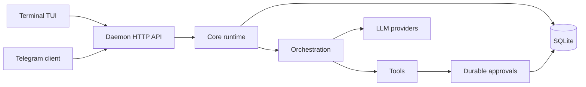

# matrixclaw


Service-backed AI coding operator for terminal and Telegram.

matrixclaw runs one local Go service, stores durable state in SQLite, and lets
thin clients attach to the same sessions, runs, approvals, provider selection,
and tool history.

```text
matrixclaw -> setup / terminal chat
Telegram   -> bot client
              |
              v
          matrixclaw service -> sessions -> runs -> orchestration -> providers/tools -> SQLite
```

## Why matrixclaw?

Most AI coding tools put runtime state inside one UI process. That makes terminal,
Telegram, or future clients drift apart.

matrixclaw uses a local-service shape instead:

- one runtime owner: matrixclaw service
- one operator CLI/TUI: `matrixclaw`
- one SQLite-backed source of truth
- one approval path for risky actions
- one provider/model policy per session
- terminal and Telegram render the same daemon state
- one shared command surface for terminal, Telegram, and future clients

## What It Does

- Terminal TUI for local coding sessions.
- Telegram client for remote chat, session picking, provider/model commands, and approvals.
- Durable sessions, messages, runs, approvals, file snapshots, and tool results.
- Provider abstraction for OpenAI-compatible, Anthropic-compatible, and other configured providers.
- Tool execution behind a single service-owned approval and dispatch path.
- Shared setup flow for provider keys, models, service settings, and Telegram.

## Why Go?

matrixclaw is intentionally boring infrastructure: compiled binaries, no Node
runtime, no Python virtualenv, no frontend server, and no large dependency tree
at install time.

Observed local development baseline:

| Component | Current observation |
| --- | ---: |
| always-on service memory | about 26 MiB RSS |
| Persistent store | one SQLite database |
| Runtime shape | two native Go binaries |

Measured with `ps -o pid,comm,rss,vsz,args -C matrixclawd` against an idle local
service. This is not a hard limit. Memory changes with active runs, provider
responses, file sizes, and tool output volume. The important design point is that
the always-on part is a small Go service, not a full UI runtime.

## Compared With Typical Agent Stacks

| Area | matrixclaw | Common Node/Python agent stack |
| --- | --- | --- |
| Runtime | native Go binaries | Node/Python runtime plus package environment |
| State | service-owned SQLite | often UI-local or process-local |
| Channels | terminal and Telegram share one backend | each channel often needs custom state glue |
| Approvals | durable service approvals | frequently in-memory UI prompts |
| Provider/model selection | stored per session | often global env/config |
| Install footprint | binaries plus config | package manager, dependency tree, runtime |
| Failure mode | client can reconnect to service truth | UI crash may lose transient state |

## What Stays Local

- SQLite sessions, messages, runs, approvals, file snapshots, and bindings.
- Provider configuration and API key metadata from setup.
- Tool approvals and execution records.
- Terminal rendering state.
- Local file reads, writes, and diffs before a provider call.

## What Can Leave Your Machine

- Prompts, selected context, tool results, and conversation history sent to the configured LLM provider.
- Telegram messages and buttons when the Telegram client is enabled.
- Network traffic caused by tools you approve or run.
- Any custom provider endpoint you configure.

matrixclaw does not make local execution magically private if you choose a remote
LLM provider or a remote chat client. The service keeps product state local; the
configured integrations still receive the data needed to do their job.

Security note: the service API is intended for local clients. By default
`matrixclawd` refuses non-loopback HTTP binds unless
`MATRIXCLAW_ALLOW_REMOTE_HTTP=1` is explicitly set.

## Install

Install the latest release:

```bash
curl -fsSL https://raw.githubusercontent.com/Suren878/matrixclaw/main/scripts/install.sh | bash
```

The installer downloads the matching GitHub Release archive, installs
`matrixclaw` and `matrixclawd` into `~/.local/bin`, prepares local config/state
directories, and starts `matrixclaw setup`.

Uninstall keeps config and state by default:

```bash
curl -fsSL https://raw.githubusercontent.com/Suren878/matrixclaw/main/scripts/uninstall.sh | bash
```

Remove config and state explicitly:

```bash
curl -fsSL https://raw.githubusercontent.com/Suren878/matrixclaw/main/scripts/uninstall.sh | bash -s -- --purge
```

## Quick Start From Source

Prerequisites:

- Go 1.26+
- Linux or another Unix-like development environment
- Optional: systemd user services for matrixclaw service autostart

```bash
git clone https://github.com/Suren878/matrixclaw.git
cd matrixclaw

mkdir -p ./bin
go build -o ./bin/matrixclaw ./cmd/matrixclaw
go build -o ./bin/matrixclawd ./cmd/matrixclawd

./bin/matrixclaw setup
./bin/matrixclaw status
./bin/matrixclaw doctor
./bin/matrixclaw service status
./bin/matrixclaw tui
```

Release builds can stamp version metadata with Go ldflags:

```bash
./scripts/build_release.sh
```

For install, uninstall, and packaging details, see [scripts/README.md](scripts/README.md)
and [packaging/README.md](packaging/README.md).

The real setup config is JSON-based; see [setup.example.json](setup.example.json)
for the sanitized shape. Do not commit your local setup file because it can
contain provider keys or Telegram tokens.

## Commands

```text
matrixclaw          open setup
matrixclaw setup    open setup
matrixclaw status   print saved setup and matrixclaw service state
matrixclaw doctor   diagnose setup, daemon, and provider registry
matrixclaw version  print client and daemon version/build info
matrixclaw providers        list setup provider catalog
matrixclaw providers verify verify configured provider model access
matrixclaw service status   print matrixclaw service state
matrixclaw service restart  restart matrixclaw service
matrixclaw service logs     print recent matrixclaw service logs
matrixclaw tui      open terminal chat
matrixclawd         internal service binary used by systemd/direct launch
```

Commands that read setup, including `status`, `providers`, and
`service status`, report missing or unsupported setup on stderr and exit
nonzero. Run `matrixclaw setup` before using normal runtime commands.

## Architecture



Core rules:

- clients render state; they do not own runtime truth
- command semantics live in `internal/controlplane`; clients only adapt them to their UI
- all real work becomes a persisted run
- tool approvals are durable and restart-safe
- provider and model selection are session data
- orchestration, providers, and tools are replaceable adapter families

## Repository Map

- [cmd/matrixclaw](cmd/matrixclaw): operator CLI and terminal entrypoint
- [cmd/matrixclawd](cmd/matrixclawd): daemon composition root
- [clients/terminal](clients/terminal): setup UI, terminal chat, shared terminal widgets
- [clients/telegram](clients/telegram): Telegram Bot API client
- [internal/core](internal/core): sessions, runs, approvals, messages, events
- [internal/api](internal/api): local HTTP API
- [internal/daemonclient](internal/daemonclient): typed daemon API client used by thin clients
- [internal/clientruntime](internal/clientruntime): shared snapshot/event reducer for client surfaces
- [internal/store](internal/store): SQLite persistence
- [internal/orchestration](internal/orchestration): execution boundary
- [internal/providers](internal/providers): provider adapters and catalog
- [internal/tools](internal/tools): builtin and MCP-backed tools
- [docs](docs): architecture, feature, and testing notes

## Current Status

matrixclaw is in active development. The current product target is a local,
single-user, daemon-backed AI operator for Ubuntu-like environments.

Good current fit:

- local developer machine
- terminal-first usage
- Telegram as a remote companion client
- durable sessions and approvals
- experimenting with provider/tool orchestration without rewriting clients

Not the current target:

- hosted multi-tenant service
- team auth and permissions
- distributed workers
- browser IDE replacement
- unattended high-risk automation

## Documentation

- [docs/README.md](docs/README.md)
- [docs/V1_PRODUCT.md](docs/V1_PRODUCT.md)
- [docs/ARCHITECTURE.md](docs/ARCHITECTURE.md)
- [docs/REPO_STRUCTURE.md](docs/REPO_STRUCTURE.md)
- [docs/TESTING.md](docs/TESTING.md)

## License

MIT. See [LICENSE](LICENSE).
