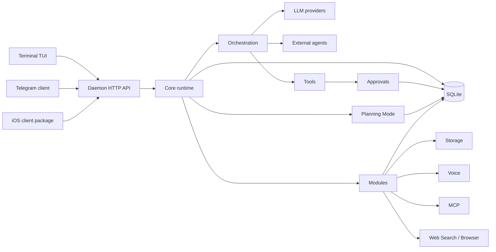

# Architecture

MatrixClaw is daemon-first. The daemon owns durable runtime state and exposes it
through a local HTTP API. Clients render that state and send commands.

## State Ownership

The daemon owns:

- sessions, messages, runs, run events, and provider usage.
- approval requests and approval decisions.
- provider and model selection.
- plan goals, plan items, and plan-run checkpoints.
- storage metadata and temporary-file lifecycle.
- module configuration for voice, web search, browser, MCP, skills, and
  external agents.
- client deliveries for Telegram and future clients.

Clients own presentation state only. Exiting the TUI does not end a session, and
restarting Telegram does not lose runs or approvals.

## Runtime Rules

- All assistant work becomes a persisted run.
- Tool approvals are durable and restart-safe.
- Provider/model choices are session data, not client process data.
- Planning Mode state is session data; the daemon advances the runner.
- Storage, voice, browser, MCP, skills, web search, and external agents are
  daemon modules behind the same local API.
- Optional heavy local runtimes run only when selected by module config.

## Repository Map

- `cmd/matrixclaw`: CLI, setup entrypoint, TUI launcher, service commands.
- `cmd/matrixclawd`: daemon composition root.
- `cmd/matrixclaw-telephony-gateway`: optional Asterisk/SIP to realtime voice
  bridge.
- `clients/terminal`: setup UI, chat TUI, and terminal widgets.
- `clients/telegram`: Telegram Bot API client, command rendering, deliveries,
  uploads, inline mode, guest mode, and voice/file routing.
- `clients/ios`: Swift package for the daemon HTTP/SSE API.
- `internal/api`: local HTTP API.
- `internal/core`: sessions, runs, approvals, messages, planning, deliveries,
  memory, subagents, and external-agent execution.
- `internal/controlplane`: shared command semantics for terminal and Telegram.
- `internal/store`: SQLite persistence.
- `internal/providers`: provider adapters, provider catalog, model catalogs, and
  provider-specific wire quirks.
- `internal/modules`: daemon modules for storage, voice, MCP, skills, delivery,
  telephony tools, and local runtimes.
- `internal/tools`: built-in assistant tools.
- `internal/mcp`: MCP client/server bridge.
- `internal/externalagents`: external-agent registry and adapters.
- `scripts`: install, uninstall, release build, and optional voice runtime
  scripts.
- `packaging`: release and Homebrew packaging notes.

## Local API Boundary

`matrixclawd` is intended for local clients. By default it refuses non-loopback
HTTP binds unless `MATRIXCLAW_ALLOW_REMOTE_HTTP=1` is set explicitly.

The daemon API is the stable boundary used by the TUI, Telegram worker, iOS
client package, MCP stdio server, and operational commands.
