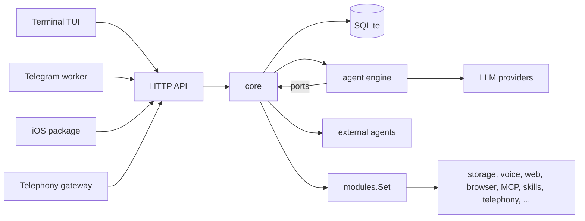

# Architecture

MatrixClaw is daemon-first. `matrixclawd` owns all durable state (SQLite,
session files, setup.json) and serves it over a local HTTP API. Clients render
that state and send commands; exiting the TUI or restarting Telegram loses no
session, run or approval.


```mermaid
flowchart LR
    TUI[Terminal TUI] --> API[HTTP API]
    TG[Telegram worker] --> API
    IOS[iOS package] --> API
    GW[Telephony gateway] --> API
    API --> CORE[core]
    CORE --> STORE[(SQLite)]
    CORE --> ENGINE[agent engine]
    CORE --> EXT[external agents]
    ENGINE --> PROVIDERS[LLM providers]
    ENGINE -- ports --> CORE
    CORE --> SET[modules.Set]
    SET --> MODS[storage, voice, web, browser, MCP, skills, telephony, ...]
```

## Repository map

| Path | What it holds |
|---|---|
| `cmd/matrixclaw` | CLI entry: setup, TUI, `service`, `providers`, `agents`, `mcp serve`, `skills`, `update`, `doctor` (code in `internal/clientcmd`) |
| `cmd/matrixclawd` | daemon entry (code in `internal/daemoncmd`) |
| `cmd/matrixclaw-telephony-gateway` | optional Asterisk/SIP to realtime voice bridge (`internal/telephony/gateway`) |
| `clients/terminal` | setup wizard (`setup`), chat TUI (`chat/runtime`), read model (`chat/readmodel`), widgets (`ui`), colour tokens (`theme`) |
| `clients/telegram` | Telegram Bot API worker: commands, deliveries, uploads, inline and guest mode, voice |
| `clients/ios` | Swift package for the HTTP/SSE API |
| `internal/daemoncmd` | composition root: bootstrap, data-dir lock, module wiring, `supervisor` (reload, restart, stop) |
| `internal/api` | HTTP API: one route table, auth, roles |
| `internal/daemonclient` | Go client of the API, used by every Go client |
| `internal/controlplane` | slash commands and screens for the terminal and Telegram |
| `internal/core` | sessions, messages, runs, approvals, tasks, subagents, deliveries, memory, external-agent runs; the engine's port adapters |
| `internal/agent` | the native agent engine (below) |
| `internal/transcript` | message, part, finish and origin types shared by core, store, api and agent |
| `internal/tools` | tool contract and the built-in file, shell and task tools |
| `internal/permission` | permission rules, subjects, bash parsing, mode presets |
| `internal/shelltask` | background shell processes and their output files |
| `internal/webtools` | `web_search` and `web_fetch` |
| `internal/modules` | module lifecycle, settings contract, and the modules: `storage`, `delivery`, `geo`, `web`, `voice` (+ `voice/realtime`), `telephony`, `browser`, `mcp`, `skills`; `localruntime` holds local voice/browser runtimes |
| `internal/procsup` | supervised local helper processes |
| `internal/providers` | provider adapters (`ai/*`), catalog, model metadata, wire quirks |
| `internal/sessionllm` | the provider runtimes sessions pick from |
| `internal/externalagents` | external agent registry and adapters (`claudecode`, `codexapp`) |
| `internal/mcp` | MCP client and the `matrixclaw mcp serve` stdio server |
| `internal/automation` | reminders and scheduled AI tasks |
| `internal/skills` | skills library (files plus its own tables) |
| `internal/setup` | typed `setup.json`, provider config, service files |
| `internal/store` | SQLite persistence (see [STORAGE.md](STORAGE.md)) |
| `internal/toolview` | how a tool call is shown, shared by the TUI and Telegram |
| `internal/updater`, `internal/version` | self-update and build stamps |
| `internal/safego`, `internal/textutil`, `internal/ids`, `internal/xdg` | leaf helpers |

## Daemon start

`daemoncmd.Run`: load setup, take `matrixclawd.lock` next to the database (a
second daemon on the same data exits), open the store, build `core.Core` and
every module once (`daemoncmd/modules.go`), bind the listener, apply the setup
(`supervisor.ApplyBootstrap`), then serve. After that, in the background: the
automation scheduler, release of held deliveries, and `Core.Recover`. Shutdown
cancels the daemon lifetime, which interrupts executing runs (they are kept for
recovery), waits for them, then closes external agents and modules.

## HTTP API

- Routes are Go 1.22 `ServeMux` patterns in one table in
  `internal/api/server.go`; `api.New(Deps)` takes every service once.
  `internal/api/routes_test.go` lists every request the clients send.
- The daemon refuses a non-loopback bind unless `MATRIXCLAW_ALLOW_REMOTE_HTTP=1`,
  and then only with an API token.
- Auth: `Authorization: Bearer <token>` (constant-time compare). The token is
  `daemon.api_token` in setup.json (setup generates it) or
  `MATRIXCLAW_API_TOKEN`. `GET /v1/health` is open.
- Roles: a client asserts who it acts for in `X-Matrixclaw-Role` (`owner`,
  `member`, `guest`; absent means owner). Every caller holds the token, so the
  daemon trusts the header as it trusts the token. Telegram sets it from the
  chat an update came from, never from message text.
- `ownerOnly` routes: admin reload/restart/stop, the session permission mode,
  and writes to setup providers, external agents, module settings, MCP, the
  skills library and temporary-storage settings. Reads stay open. Global permission rules are owner-only,
  guests keep no rules, and members and guests are refused (403) in sessions
  that run unattended (`core.RunsUnattended`: full_auto or external agent).
  Clients only hide what the daemon would refuse.

## Live events and the terminal read model

- `GET /v1/events` is a per-session SSE stream: `message.created|updated`,
  `run.updated`, `tool.updated`, `approval.requested|resolved`,
  `input.updated`, `task.updated`, `todo.updated`, `context.updated` (context
  size the engine measured after each step). Replay with `?after=` covers only
  a 256-event history shared by all sessions.
- So the terminal subscribes first, then loads `GET /v1/snapshot`, and drops
  events at or below the snapshot's `event_id`. After that it changes only
  through events (`clients/terminal/chat/readmodel`), reloading on reconnect,
  session switch and commands that ask for it (`ReloadSnapshot`).
- Chat rows are reconciled by ID and revision, so expanded output stays
  expanded. Context usage in the header comes only from the daemon.
- `internal/toolview` (`Describe`, `FileChangeOf`) gives a tool call's title,
  progress verb, main parameter and file change to the TUI and Telegram alike.

## Commands and screens

`internal/controlplane` turns slash commands into screens. A `Dispatcher` holds
one `*daemonclient.Client` (client name, external key, role) and answers with a
`Result`: text, picker, form, prompt, text edit, confirm or info. Clients render
pickers themselves (Telegram buttons and paging, terminal menus); a picker
carries the command that shows it again. Module settings are drawn by one
generic screen, `/modules <id> [open|confirm|set] <path>`; external agents,
skills, MCP and storage have screens of their own. Provider forms are kept by
an opaque id (`/provider form <id> ...`) so the API key never travels inside a
command string.

## Runs

A message is accepted by `core` as a run (`accepted`) and executed on its own
goroutine by `Core.ExecuteRun`: `claim` (under the session gate) makes it
`running`; external-agent sessions go to their adapter, native ones build an
`agent.Engine` and call `Engine.Run(ctx, Task)`. Its `Outcome` (`completed`
with a stop reason, `waiting_approval`, `waiting_events`, `interrupted`,
`canceled`, `failed`) is applied by core.

Run status has one writer, `transition` (`internal/core/run_lifecycle.go`),
with one edge table (`runEdges`):

```text
accepted ─▶ running ─▶ completed
               │  ▲
               ▼  │
   waiting_approval / waiting_events
any status that has not ended ─▶ failed | canceled
```

`transition` sets `finished_at`, saves or deletes the wakeup of a run waiting
for events, clears the checkpoint on the end, seals the reply in the same write
(`store.SealRun`; an ended run stays ended, `ErrRunEnded`), rejects an ended
run's open approvals, syncs the subagent task the run works for, and publishes
`run.updated`. A failed run cancels its blocking subagents.

`afterRun` runs when the executor lets go of a run (or from `CancelRun` for a
parked one): it starts the session's next queued message, wakes the session
for finished background work, or resumes a parked run whose decision or event
arrived meanwhile. Every step is idempotent.

**Cancel.** `CancelRun` writes `canceled`, then cancels the run's context with
the cause `agent.ErrCanceled`. Any other stop (shutdown, release) cancels
without that cause and counts as an interrupt. Canceling a run also stops the
shell tasks and subagents it started.

**Recovery.** A run found `running` without an executor was interrupted.
`claim` counts the recovery (more than 8 fails the run) and builds a plan for
every call left without a result (`agent.Task.Interrupted`, `Settle`): `rerun`
read-only and deferred calls, `ask` again for a mutating call, `answer` an
unknown tool with an error. A mutating call never reruns without a fresh
approval. `Core.Recover`, called once at daemon start, marks leftover shell
tasks `lost`, resumes each active run once, syncs subagent tasks whose child
run already ended, and settles idle sessions (next queued message or a wake
run). External-agent runs keep their own recovery in core.

## Agent engine

`internal/agent` is the loop: steps, budget (steps, active time, tokens) and a
final turn without tools, loop guard, output-limit continuation, completion
check for open todo items, context notes, summaries. It knows nothing of
SQLite, HTTP or clients and talks to core through ports
(`internal/agent/ports.go`):

| Port | Core adapter | Purpose |
|---|---|---|
| `Model` | `providers.Runtime` | one generation |
| `Journal` | `coreJournal` | load the window from the latest boundary, append and stream messages, checkpoint, record `run_steps` |
| `Tools` | `coreTools` | specs, `Authorize` (rules, concurrency key, barrier), `Execute` (result or approval request) |
| `Approvals` | `coreApprovals` | record an approval request, report open ones |
| `Inbox` | `coreInbox` | steer input, decided approvals, finished background tasks |
| `Sink` | `coreSink` | live events to clients |
| `Prompts` | `corePrompts` | fixed system prompt per run; changing state as a context note |
| `Todos` | `coreTodos` | open todo items of the run's `/continue` chain |

While a native run is active the engine is the only writer of its session's
transcript; everything else reaches it through the inbox. Messages are ordered
by an integer `seq` and never rewritten. `Core.ExecuteTool` serves run-less
calls only (tools API, voice, MCP server).

Subpackages: `context` (token estimates, conversation building, elision,
summary boundaries), `toolsched` (parallel batches of up to 8 calls, daemon-wide
keyed locks, the model-request semaphore `daemon.model_concurrency`), `prompt`
(fixed texts and tool guidance), `todo` (items, validation, rendering),
`agenttest` (scripted model and port fakes for tests).

## Tasks, subagents, await

- Background work is one task model (`core.Task`, table `tasks`, one
  `task.updated` event) with two kinds. `shell`: a command in its own process
  group (`internal/shelltask`) with a size-capped output file; `bash` moves a
  command still running after 120 s to the background. `subagent`: a child run
  started by the `agent` tool.
- Shell task: `running` → `completed`/`failed` by exit code, `canceled`, or
  `lost` after a restart. Subagent task follows its child run inside
  `transition`: `running` ⇄ `waiting_approval` → `completed`/`failed`/`canceled`.
- A blocking `agent` call waits for the child's run to end and returns its
  summary; the parent stays `running` in that call, holds no model slot, and
  its time there is not counted. A background call returns the task; its end
  is an event for the parent session. A replayed call finds its task by
  `(run_id, parent_tool_call_id)`.
- A child's approval is its own (`approvals.task_id`), listed and announced in
  the parent's session and sent as an approval delivery to the parent's chat.
  A read-only child's approval is stored already rejected, without asking.
- `await` parks a run in `waiting_events` with a `run_wakeups` row; a finished
  task, the user's message or the timer (`Core.RunWakeups` ticker) wakes it.
  Finished work in an idle session starts a `wake` run.

## Tools and approvals

- A tool is a `tools.Executor` (`Spec`, `Execute`). `Spec.Effect`
  (`readonly`/`mutation`) drives concurrency, read-only subagents and recovery;
  `Spec.Asks` says whether a call no rule decides waits for the user.
- Core alone decides (`core.checkPermission`): session and global rules, then
  the mode preset (`default`, `accept_edits`, `full_auto`); deny wins over ask
  over allow. `permission.Builtin` (`memory: list` = allow) is in every preset
  and cannot be deleted; a stored ask/deny rule on `memory` still wins. The
  same check covers runs, the tools API, voice and the MCP server.
- A call that asks runs only with a grant: its newest approval is approved and
  it has no result yet, read from the store per run, so a grant runs it once.
  Executors never see approvals.
- What the approval shows comes from the tool's optional `tools.Previewer`
  (side-effect free: a `tools.FileChange` diff, the command and its
  directory), built on the call's goroutine under its concurrency key; a
  preview error answers the call before anyone is asked. Tools without one
  show "Run <tool>" and the arguments. An ask rule adds "Asked by rule ...".
- A mutating call that waits for approval is a barrier: later calls of the
  same reply wait, earlier ones run.
- `tools.Result.Status` (`success`/`error`/`neutral`, empty = success) is the
  only status field. Results over about 8k tokens go to
  `sessions/<id>/tool-output/`, and the model gets head, tail and path.
- `read` and `grep` refuse credential files (setup.json, `daemon.env`, the
  Codex OAuth store, Codex and Claude Code credentials).

## Web tools

`internal/webtools` offers two tools, registered by the `web` module.
`web_search {query, limit}` asks the configured provider (Tavily, Serper,
SearXNG) and falls back to DuckDuckGo. `web_fetch {url}` fetches through an
SSRF-safe transport (public addresses only, every redirect re-validated and
checked against the call's permission rules), reads up to 5 MB, converts HTML
to markdown with readability, and returns at most 400,000 characters; it never
drives a browser and notes when a page needs JavaScript. Deep research runs
through read-only subagents.

## Setup config

`setup.json` is one typed `setup.Config` owned by `internal/setup`:

- Every edit is `Service.Update(func(*Config) error)`: load, change,
  canonicalize, `Config.Validate` (structure only: no network, no env), save
  atomically under one lock. Provider edits, the session model switch and
  module settings change only their own part.
- The file stores the user's choices, not built-in defaults.
  `ProviderConfig.Effective` fills catalog defaults; `Runtime` adds the API key
  from the file or the environment. `CheckProvider` (a usable key) runs when a
  provider is saved, not in `Validate`.
- The terminal wizard edits a `Config` in memory and saves with
  `Service.Apply`, the only place that checks the Telegram token; it copies
  only the sections the wizard owns.
- Update requests use pointer fields: absent leaves a value, empty clears or
  resets it. Clients see secrets only as masked previews.

## Modules

Storage, delivery, maps, web, TTS, STT, realtime voice, telephony, browser,
MCP and skills implement `modules.Module`:

```go
ID() string
Apply(ctx, setup.Config) error // at start and after every setup change; cheap when unchanged
Tools() []tools.Executor       // offered now; none while off or unconfigured
Context() string               // system prompt paragraph
Status(ctx) Status             // enabled, ready, state, facts; no network I/O
Close() error
```

- `modules.Set` owns them and is core's tool executor: the base tools (files,
  shell, tasks, todo, await, memory, agent, reminders) plus each module's
  current tools, in a registry swapped atomically after each `Apply`.
- `supervisor.Reload` (`POST /v1/admin/reload`, the wizard, every API handler
  after a setup write) loads setup.json and, under one lock, applies external
  agents, the module set, session LLMs, the assistant profile with module
  paragraphs, and Telegram. Each part does nothing when its settings did not
  change; MCP reconnects only changed servers, and one failing server does not
  disable the others.
- `GET /v1/modules` lists statuses; the model's runtime note is built from
  them (without `state`, so it stays stable).
- A module with settings implements `modules.Configurable`: `Settings` returns
  typed items (toggle, choice, text, secret, action, page, info) and `Change`
  runs a change (install an engine, download a model) and returns the
  setup.json edit, whether to reload, and the page to show next. Served at
  `GET|POST /v1/settings/{module}`; the API saves the edit and reloads.
- Local voice servers run under one `procsup.Supervisor` owned by
  `localruntime.Runtime`: one process per provider, readiness probed outside
  the lock, stopped when deselected and on shutdown, and with `Pdeathsig` on
  Linux (one-shot commands get it through `procsup.Prepare`). The browser's
  Playwright MCP server is owned by its MCP session.
- Realtime voice providers are `realtime.ProviderSpec`s with a codec over one
  websocket session engine.

## Deliveries

Clients that cannot hold an event stream fetch work from a delivery queue
(`client_deliveries`; `GET /v1/client-deliveries`, then `ack` or `fail`).
Types: `run` (a run's reply), `document` (`send_file`), `notice`, `approval`
(a subagent's approval sent to the parent's chat). A run gets a delivery only
when its client sets `ReceivesDeliveries` in its capabilities (Telegram,
automation); the terminal follows events instead. `reply_once` marks a target
that takes a single reply (Telegram inline and guest). Restart notices are
`held` until the next start releases them.

## Planned after v0.2.0

- Collapse the `internal/store` migrations into a canonical `001_init.sql`
  with `PRAGMA user_version`.
- Drop read-time setup.json rewrites and persisted-value aliases (session
  runtime `codex`, web search `api_key`, browser provider and runtime-mode
  aliases).
- Remove the `approvals.action` and `tasks.result_message_id` columns.
- Drop the legacy client-capabilities read rule in
  `internal/store/sqlite_client_capabilities.go`.
