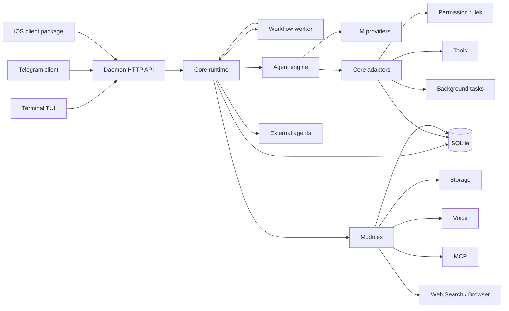

# Architecture

MatrixClaw is daemon-first. The daemon owns durable runtime state and exposes it
through a local HTTP API. Clients render that state and send commands.

```mermaid
flowchart LR
    TUI[Terminal TUI] --> API[Daemon HTTP API]
    TG[Telegram client] --> API
    IOS[iOS client package] --> API
    API --> CORE[Core runtime]
    CORE --> STORE[(SQLite)]
    CORE --> WF[Workflow worker]
    WF --> CORE
    CORE --> ENGINE[Agent engine]
    CORE --> AGENTS[External agents]
    ENGINE --> PROVIDERS[LLM providers]
    ENGINE --> PORTS[Core adapters]
    PORTS --> PERM[Permission rules]
    PORTS --> TOOLS[Tools]
    PORTS --> TASKS[Background tasks]
    PORTS --> STORE
    CORE --> MODULES[Modules]
    MODULES --> STORAGE[Storage]
    MODULES --> VOICE[Voice]
    MODULES --> MCP[MCP]
    MODULES --> WEB[Web Search / Browser]
    MODULES --> STORE
```

## State Ownership

The daemon owns:

- sessions, messages, runs, run steps, run events, and provider usage.
- approval requests, approval decisions, and permission rules.
- provider and model selection, and per-session run budgets.
- each session's todo list.
- background tasks (shell commands and subagents) and their output files.
- storage metadata and temporary-file lifecycle.
- module configuration for voice, web search, browser, MCP, skills, and
  external agents.
- client deliveries for Telegram and future clients.

Clients own presentation state only. Exiting the TUI does not end a session, and
restarting Telegram does not lose runs or approvals.

## Clients and Live Events

Clients follow a session through `GET /v1/events` (server-sent events: messages,
runs, tool states, approvals, todo lists, subagents, pending inputs, and
`context.updated`, the context size the engine measured after each step).
`ClientSnapshot.event_id` names the newest event a snapshot already reflects.
The terminal opens the event stream first and loads the snapshot second,
dropping events at or below `event_id`; after that it changes only through
events (`clients/terminal/chat/readmodel`), reloading on reconnect and session
switches. How a tool call is shown (title, progress verb, main parameter,
file change) comes from `internal/toolview` for the terminal and Telegram alike.

## Runtime Rules

- All assistant work becomes a persisted run.
- Tool approvals are durable and restart-safe; every tool entry point (runs,
  the tools API, voice, the MCP server) obeys the same permission rules.
- Provider/model choices are session data, not client process data.
- Todo lists are session data; the model writes them, clients show them.
- Storage, voice, browser, MCP, skills, web search, and external agents are
  daemon modules behind the same local API.
- Optional heavy local runtimes run only when selected by module config.
- One daemon per data directory: `matrixclawd` holds `matrixclawd.lock` next to
  the database for its lifetime.

## Native Runs

A run is accepted by `internal/core` and executed in a goroutine of its own,
which calls `Core.ExecuteRun`; runs left active by a restart are recovered by
`Core.RecoverActiveRuns`. External agent sessions go to their adapter; native sessions build an
`agent.Engine` and call `Engine.Run(ctx, Task)`, then apply its `Outcome`
(`completed` with a stop reason, `waiting_approval`, `waiting_events`,
`interrupted`, `canceled` or `failed`).

`internal/agent` is the loop. It knows nothing of SQLite, HTTP, or clients and
talks to them through ports (`internal/agent/ports.go`):

| Port | Core adapter | Purpose |
|---|---|---|
| `Journal` | `coreJournal` | load the context window from the latest boundary, append messages, checkpoint, record `run_steps` |
| `Tools` | `coreTools` | tool specs, authorisation (permission rules, concurrency key, barrier), execution |
| `Approvals` | `coreApprovals` | park a call for a user decision |
| `Inbox` | `coreInbox` | steer input, decided approvals, finished background tasks |
| `Sink` | `coreSink` | stream events to clients |
| `Prompts` | `corePrompts` | stable system prompt, changing state as a context note |
| `Todos` | `coreTodos` | open todo items of the run's `/continue` chain |

While a native run is active the engine is the only writer of its session's
transcript; everything else reaches it through the inbox. Messages are ordered
by an integer `seq`, and persisted messages are never rewritten.

Engine packages:

- `internal/agent`: steps, budget and final turn, loop guard, output-limit
  continuation, completion check, context note, summaries.
- `internal/agent/context`: token estimates, conversation building, elision,
  summary boundaries.
- `internal/agent/toolsched`: parallel tool batches, daemon-wide keyed locks,
  the model-request semaphore (`daemon.model_concurrency`).
- `internal/agent/prompt`: fixed prompt texts and tool guidance.
- `internal/agent/todo`: todo items, validation, rendering.
- `internal/agent/agenttest`: scripted model and fakes for engine tests.

Around the engine:

- `internal/transcript`: message, part, finish and origin types shared by
  `core`, `store`, `api`, and `agent`.
- `internal/permission`: rules, subjects, bash parsing, and mode presets;
  `core.checkPermission` applies them for every tool call.
- `internal/shelltask`: background shell commands in their own process groups
  with size-capped output files; `core` tracks them in the `tasks` table with
  background subagents.
- `await` parks a run in `waiting_events`; `run_wakeups` timers, finished
  tasks, and user messages wake it. Finished work in an idle session starts a
  `wake` run.
- On start the daemon marks leftover shell tasks `lost`, recovers active runs
  from their checkpoints, and re-arms wake timers.

See the [design spec](superpowers/specs/2026-09-23-long-running-agent-design.md)
for the details and the as-built notes of each stage.

## Repository Map

- `cmd/matrixclaw`: CLI, setup entrypoint, TUI launcher, service commands.
- `cmd/matrixclawd`: daemon composition root.
- `cmd/matrixclaw-telephony-gateway`: optional Asterisk/SIP to realtime voice
  bridge.
- `clients/terminal`: setup UI, chat TUI, and terminal widgets; colours are
  tokens in `clients/terminal/theme`.
- `clients/telegram`: Telegram Bot API client, command rendering, deliveries,
  uploads, inline mode, guest mode, and voice/file routing.
- `clients/ios`: Swift package for the daemon HTTP/SSE API.
- `internal/api`: local HTTP API.
- `internal/core`: sessions, runs, approvals, messages, todo lists, background
  tasks, deliveries, memory, subagents, external-agent execution, and the
  engine's port adapters.
- `internal/agent`: the native agent engine (see above).
- `internal/permission`: permission rules and bash command parsing.
- `internal/shelltask`: background shell processes and their output files.
- `internal/transcript`: message types.
- `internal/controlplane`: shared command semantics for terminal and Telegram.
- `internal/toolview`: shared presentation of tool calls for the clients.
- `internal/store`: SQLite persistence.
- `internal/providers`: provider adapters, provider catalog, model catalogs, and
  provider-specific wire quirks.
- `internal/modules`: daemon modules for storage, voice, MCP, skills, delivery,
  telephony tools, and local runtimes.
- `internal/tools`: built-in assistant tools.
- `internal/mcp`: MCP client/server bridge.
- `internal/externalagents`: external-agent registry and adapters.
- `scripts`: install, uninstall, release build, and optional voice runtime
  scripts.
- `packaging`: release and Homebrew packaging notes.

## Local API Boundary

`matrixclawd` is intended for local clients. By default it refuses non-loopback
HTTP binds unless `MATRIXCLAW_ALLOW_REMOTE_HTTP=1` is set explicitly.

The daemon API is the stable boundary used by the TUI, Telegram worker, iOS
client package, MCP stdio server, and operational commands.
