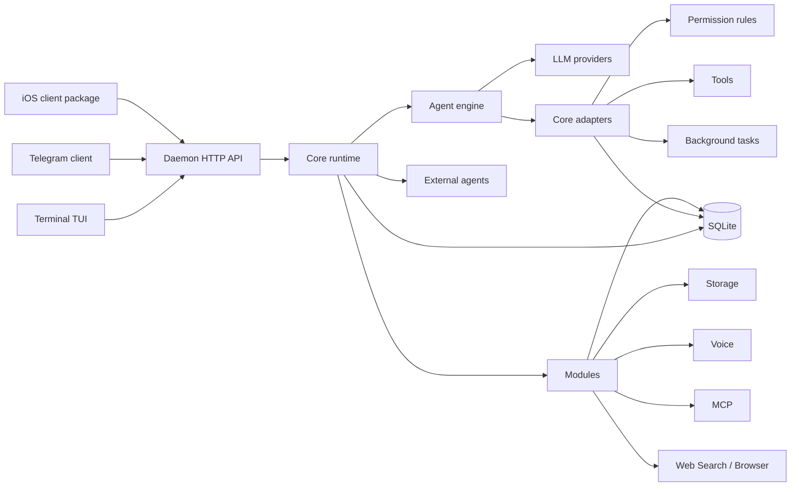

# Architecture

MatrixClaw is daemon-first. The daemon owns durable runtime state and exposes it
through a local HTTP API. Clients render that state and send commands.


```mermaid
flowchart LR
    TUI[Terminal TUI] --> API[Daemon HTTP API]
    TG[Telegram client] --> API
    IOS[iOS client package] --> API
    API --> CORE[Core runtime]
    CORE --> STORE[(SQLite)]
    CORE --> ENGINE[Agent engine]
    CORE --> AGENTS[External agents]
    ENGINE --> PROVIDERS[LLM providers]
    ENGINE --> PORTS[Core adapters]
    PORTS --> PERM[Permission rules]
    PORTS --> TOOLS[Tools]
    PORTS --> TASKS[Background tasks]
    PORTS --> STORE
    CORE --> MODULES[Modules]
    MODULES --> STORAGE[Storage]
    MODULES --> VOICE[Voice]
    MODULES --> MCP[MCP]
    MODULES --> WEB[Web Search / Browser]
    MODULES --> STORE
```

## State Ownership

The daemon owns:

- sessions, messages, runs, run steps, run events, and provider usage.
- approval requests, approval decisions, and permission rules.
- provider and model selection, and per-session run budgets.
- each session's todo list.
- background tasks (shell commands and subagents) and their output files.
- storage metadata and temporary-file lifecycle.
- module configuration for voice, web search, browser, MCP, skills, and
  external agents.
- client deliveries for Telegram and future clients.

Clients own presentation state only. Exiting the TUI does not end a session, and
restarting Telegram does not lose runs or approvals.

## Clients and Live Events

Clients follow a session through `GET /v1/events` (server-sent events: messages,
runs, tool states, approvals, todo lists, subagents, pending inputs, and
`context.updated`, the context size the engine measured after each step).
`ClientSnapshot.event_id` names the newest event a snapshot already reflects.
The terminal opens the event stream first and loads the snapshot second,
dropping events at or below `event_id`; after that it changes only through
events (`clients/terminal/chat/readmodel`), reloading on reconnect and session
switches. How a tool call is shown (title, progress verb, main parameter,
file change) comes from `internal/toolview` for the terminal and Telegram alike.

## Runtime Rules

- All assistant work becomes a persisted run.
- Tool approvals are durable and restart-safe; every tool entry point (runs,
  the tools API, voice, the MCP server) obeys the same permission rules.
- Provider/model choices are session data, not client process data.
- Todo lists are session data; the model writes them, clients show them.
- Storage, voice, browser, MCP, skills, web search, and external agents are
  daemon modules behind the same local API.
- Optional heavy local runtimes run only when selected by module config.
- One daemon per data directory: `matrixclawd` holds `matrixclawd.lock` next to
  the database for its lifetime.

## Native Runs

A run is accepted by `internal/core` and executed in a goroutine of its own,
which calls `Core.ExecuteRun`: `claim` (under the session gate) makes the run
`running`, then external agent sessions go to their adapter and native sessions
build an `agent.Engine` and call `Engine.Run(ctx, Task)`, whose `Outcome`
(`completed` with a stop reason, `waiting_approval`, `waiting_events`,
`interrupted`, `canceled` or `failed`) core applies.

Run status has one writer, `transition` (`internal/core/run_lifecycle.go`):

```text
accepted ─▶ running ─▶ completed
               │  ▲
               ▼  │
   waiting_approval / waiting_events
any status that has not ended ─▶ failed | canceled
```

It keeps `finished_at`, the wakeup of a run waiting for events, the checkpoint
(cleared on the end) and the subagent task the run works for, seals the reply in
the same transaction, rejects an ended run's approvals and publishes
`run.updated`. `afterRun`, run when the executor lets go of a run (or by
`CancelRun` for a parked one), starts the session's next queued message, wakes
it for finished background work, or resumes a parked run whose decision or
event arrived while it parked. Canceling cancels the run's context with the
cause `agent.ErrCanceled`; any other stop interrupts it.

A run found `running` without an executor was interrupted: `claim` counts the
recovery (at most 8) and tells the engine how to settle each call left without
a result (`agent.Task.Interrupted`: run again, ask again for a mutating call,
or answer), so recovery too goes through the engine. `Core.Recover`, called
once at daemon start, marks leftover shell tasks lost, resumes each active run
once, tells subagent tasks whose child ended, and settles idle sessions.

`internal/agent` is the loop. It knows nothing of SQLite, HTTP, or clients and
talks to them through ports (`internal/agent/ports.go`):

| Port | Core adapter | Purpose |
|---|---|---|
| `Journal` | `coreJournal` | load the context window from the latest boundary, append messages, checkpoint, record `run_steps` |
| `Tools` | `coreTools` | tool specs, authorisation (permission rules, concurrency key, barrier), execution or the approval request |
| `Approvals` | `coreApprovals` | park a call for a user decision |
| `Inbox` | `coreInbox` | steer input, decided approvals, finished background tasks |
| `Sink` | `coreSink` | stream events to clients |
| `Prompts` | `corePrompts` | stable system prompt, changing state as a context note |
| `Todos` | `coreTodos` | open todo items of the run's `/continue` chain |

While a native run is active the engine is the only writer of its session's
transcript; everything else reaches it through the inbox. `Core.ExecuteTool`
serves run-less calls only (API, voice, MCP server). Messages are ordered
by an integer `seq`, and persisted messages are never rewritten.

Engine packages:

- `internal/agent`: steps, budget and final turn, loop guard, output-limit
  continuation, completion check, context note, summaries.
- `internal/agent/context`: token estimates, conversation building, elision,
  summary boundaries.
- `internal/agent/toolsched`: parallel tool batches, daemon-wide keyed locks,
  the model-request semaphore (`daemon.model_concurrency`).
- `internal/agent/prompt`: fixed prompt texts and tool guidance.
- `internal/agent/todo`: todo items, validation, rendering.
- `internal/agent/agenttest`: scripted model and fakes for engine tests.

Around the engine:

- `internal/transcript`: message, part, finish and origin types shared by
  `core`, `store`, `api`, and `agent`.
- `internal/permission`: rules, subjects, bash parsing, and mode presets;
  `core.checkPermission` applies them for every tool call.
- Tool contract (`internal/tools`): a `Spec` says whether a call asks by
  default (`Asks`); core alone decides from that, the rules and the mode
  (deny, then ask, then allow; `permission.Builtin` adds `memory: list` =
  allow to every mode, which no stored rule removes). A call that asks runs
  only on a grant: its newest approval is approved and it has no result yet,
  read from the run's approvals, so a grant runs it once. What the approval
  shows comes from the tool's optional side-effect-free `Preview` (a
  `tools.FileChange` diff, the command and its directory), built on the call's
  goroutine under its concurrency key; a preview error answers the call.
  Executors never see approvals. `Result.Status` is the only status field.
- `internal/shelltask`: background shell commands in their own process groups
  with size-capped output files; `core` tracks them as `Task`s (kind `shell`)
  in the `tasks` table, next to subagents (kind `subagent`), with one
  `task.updated` event.
- Subagents: the `agent` tool starts a child run; a blocking call waits for
  the child's run to end, a background one returns its task, whose end is an
  event. A child's approval is its own (`approvals.task_id`), listed and
  announced in the parent's session and sent to the parent's chat.
- `await` parks a run in `waiting_events`; `run_wakeups` timers, finished
  tasks, and user messages wake it. Finished work in an idle session starts a
  `wake` run.
- On start the daemon calls `Core.Recover` (see above); wake timers fire on the
  first tick of `RunWakeups`.

See the [design spec](superpowers/specs/2026-09-23-long-running-agent-design.md)
for the details and the as-built notes of each stage.

## Setup Config

`setup.json` is one typed `setup.Config` owned by `internal/setup`:

- Every edit goes through `Service.Update(func(*Config) error)`, which loads,
  changes, validates (structure only, no network) and saves the file under
  one lock. Provider edits, the session model switch and module settings
  change only their own part of the file.
- The file stores the user's choices, not built-in defaults: a provider keeps
  only what differs from its catalog entry, voice and browser providers only
  what differs from theirs. `ProviderConfig.Effective`/`Runtime` and the
  module descriptors fill the defaults when the config is read.
- The terminal setup wizard edits a `Config` in memory and saves it with
  `Service.Apply`, the only place that checks the Telegram token.
- Update requests use pointer fields: absent leaves a value alone, empty
  clears or resets it. Form layouts live in the clients: the controlplane
  keeps an open provider form by an opaque id, so the API key never travels
  inside a command string.

## Modules

Storage, delivery, maps, web search, TTS, STT, realtime voice, telephony,
browser, MCP and skills are modules (`internal/modules`): each implements
`Module` (`ID`, `Apply(ctx, setup.Config)`, `Tools`, `Context`, `Status`,
`Close`).

- `daemoncmd/modules.go` builds every module once; `modules.Set` owns them and
  is the core's tool executor. It serves the base tools (shell, files, todo,
  memory, agents, automation) plus the tools each module offers now, so a
  module that is off or unconfigured offers none (telephony tools appear only
  with a gateway).
- `supervisor.Reload` (`POST /v1/admin/reload`, the wizard, and every API
  handler after a setup edit) loads setup.json and applies it under one lock:
  session LLMs, external agents, the module set, the assistant profile with
  the modules' prompt paragraphs, and Telegram. Each part does nothing when
  its own settings did not change; MCP reconnects only changed servers.
- `Status` is cheap and render-ready (`enabled`, `ready`, `state`, facts,
  tools); `GET /v1/modules` lists them and the model's runtime note is built
  from them.
- Local runtimes run under one `procsup.Supervisor` owned by the daemon's
  `localruntime.Runtime`: one process per provider, readiness probed outside
  the lock, stopped on shutdown (and with `Pdeathsig` on Linux).
- Realtime voice providers are `realtime.ProviderSpec`s (catalog, key check,
  dial) with a `Codec`; one websocket session engine serves them all. The
  realtime module resolves provider settings and API keys once per reload and
  composes the assistant identity, custom instructions and, for phone calls,
  the phone prompt.

## Repository Map

- `cmd/matrixclaw`: CLI, setup entrypoint, TUI launcher, service commands.
- `cmd/matrixclawd`: daemon composition root.
- `cmd/matrixclaw-telephony-gateway`: optional Asterisk/SIP to realtime voice
  bridge.
- `clients/terminal`: setup UI, chat TUI, and terminal widgets; colours are
  tokens in `clients/terminal/theme`.
- `clients/telegram`: Telegram Bot API client, command rendering, deliveries,
  uploads, inline mode, guest mode, and voice/file routing.
- `clients/ios`: Swift package for the daemon HTTP/SSE API.
- `internal/api`: local HTTP API.
- `internal/core`: sessions, runs, approvals, messages, todo lists, background
  tasks, deliveries, memory, subagents, external-agent execution, and the
  engine's port adapters.
- `internal/agent`: the native agent engine (see above).
- `internal/permission`: permission rules and bash command parsing.
- `internal/shelltask`: background shell processes and their output files.
- `internal/transcript`: message types.
- `internal/controlplane`: shared command semantics for terminal and Telegram.
- `internal/toolview`: shared presentation of tool calls for the clients.
- `internal/store`: SQLite persistence.
- `internal/providers`: provider adapters, provider catalog, model catalogs, and
  provider-specific wire quirks.
- `internal/modules`: the module lifecycle and the daemon modules (storage,
  voice, realtime voice, telephony, browser, MCP, skills, web, delivery, geo)
  and the local voice and browser runtimes.
- `internal/procsup`: supervised local helper processes.
- `internal/tools`: built-in assistant tools.
- `internal/webtools`: `web_search` (provider clients) and `web_fetch`
  (SSRF-safe fetch, readability and markdown); no state of their own.
- `internal/mcp`: MCP client/server bridge.
- `internal/externalagents`: external-agent registry and adapters.
- `scripts`: install, uninstall, release build, and optional voice runtime
  scripts.
- `packaging`: release and Homebrew packaging notes.

## Local API Boundary

`matrixclawd` is intended for local clients. By default it refuses non-loopback
HTTP binds unless `MATRIXCLAW_ALLOW_REMOTE_HTTP=1` is set explicitly.

The daemon API is the stable boundary used by the TUI, Telegram worker, iOS
client package, MCP stdio server, and operational commands.
