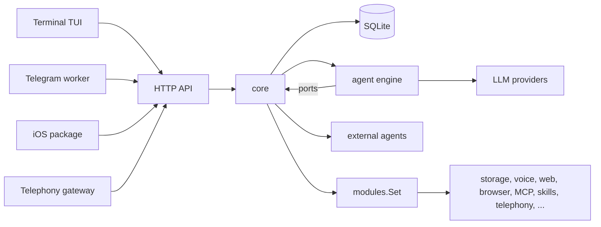

# Architecture

MatrixClaw is daemon-first. `matrixclawd` owns all durable state (SQLite,
session files, setup.json) and serves it over a local HTTP API. Clients render
that state and send commands; exiting the TUI or restarting Telegram loses no
session, run or approval.


```mermaid
flowchart LR
    TUI[Terminal TUI] --> API[HTTP API]
    TG[Telegram worker] --> API
    IOS[iOS package] --> API
    GW[Telephony gateway] --> API
    API --> CORE[core]
    CORE --> STORE[(SQLite)]
    CORE --> ENGINE[agent engine]
    CORE --> EXT[external agents]
    ENGINE --> PROVIDERS[LLM providers]
    ENGINE -- ports --> CORE
    CORE --> SET[modules.Set]
    SET --> MODS[storage, voice, web, browser, MCP, skills, telephony, ...]
```

## Repository map

| Path | What it holds |
|---|---|
| `cmd/matrixclaw` | CLI entry: setup, TUI, `service`, `providers`, `agents`, `mcp serve`, `skills`, `update`, `doctor` (code in `internal/clientcmd`) |
| `cmd/matrixclawd` | daemon entry (code in `internal/daemoncmd`) |
| `cmd/matrixclaw-telephony-gateway` | optional Asterisk/SIP to realtime voice bridge (`internal/telephony/gateway`) |
| `clients/terminal` | setup wizard (`setup`), chat TUI (`chat/runtime`), read model (`chat/readmodel`), widgets (`ui`), colour tokens (`theme`) |
| `clients/telegram` | Telegram Bot API worker: commands, deliveries, uploads, inline and guest mode, voice |
| `clients/ios` | Swift package for the HTTP/SSE API |
| `internal/daemoncmd` | composition root: bootstrap, data-dir lock, module wiring, `supervisor` (reload, restart, stop) |
| `internal/api` | HTTP API: one route table, auth, roles |
| `internal/daemonclient` | Go client of the API, used by every Go client |
| `internal/controlplane` | slash commands and screens for the terminal and Telegram |
| `internal/core` | sessions, messages, runs, approvals, tasks, subagents, deliveries, external-agent runs; the engine's port adapters |
| `internal/memory` | persistent memory entries and suggestions, the prompt's memory section and the `memory` tool |
| `internal/agent` | the native agent engine (below) |
| `internal/transcript` | message, part, finish and origin types shared by core, store, api and agent |
| `internal/tools` | tool contract and the built-in file, shell and task tools |
| `internal/checkpoint` | file checkpoints: shadow git snapshots of working directories, diff, restore (see [CHECKPOINTS.md](CHECKPOINTS.md)) |
| `internal/permission` | permission rules, subjects, bash parsing, mode presets |
| `internal/glob` | the one glob matcher (`**`, classes, braces) and `.gitignore` rules, for path rules and the search tools |
| `internal/repomap` | ranked map of a code base's definitions (Go parser, chroma lexers, PageRank) for the `repo_map` tool (see [REPO_MAP.md](REPO_MAP.md)) |
| `internal/shelltask` | background shell processes and their output files |
| `internal/sandbox` | the shell sandbox: modes, bubblewrap, the Landlock helper, sandbox-exec (see [SANDBOX.md](SANDBOX.md)) |
| `internal/hooks` | user hooks (Claude Code protocol) and the checks after edits (see [HOOKS.md](HOOKS.md)) |
| `internal/lsp` | language servers: JSON-RPC client, one server per language and project root, diagnostics after edits, the `lsp` tool (see [LSP.md](LSP.md)) |
| `internal/webtools` | `web_search` and `web_fetch` |
| `internal/modules` | module lifecycle, settings contract, and the modules: `storage`, `delivery`, `geo`, `web`, `voice` (+ `voice/realtime`), `telephony`, `browser`, `mcp`, `skills`; `localruntime` holds local voice/browser runtimes |
| `internal/procsup` | supervised local helper processes (voice and language servers) |
| `internal/providers` | provider adapters (`ai/*`), catalog, model metadata, wire quirks |
| `internal/sessionllm` | the provider runtimes sessions pick from |
| `internal/externalagents` | external agent registry, adapters (`claudecode`, `codexapp`) and the reply builder (`reply`) |
| `internal/mcp` | MCP client and the `matrixclaw mcp serve` stdio server |
| `internal/automation` | reminders and scheduled AI tasks; each job keeps its client's capabilities and delivery address |
| `internal/skills` | skills library: skill directories, their rows in the store's schema, install (local, plugin, Hermes tree, GitHub clone), the `skill_*` tools |
| `internal/setup` | typed `setup.json`, provider config, service files |
| `internal/store` | SQLite persistence (see [STORAGE.md](STORAGE.md)) |
| `internal/toolview` | how a tool call is shown, shared by the TUI and Telegram |
| `internal/updater`, `internal/version` | self-update and build stamps |
| `internal/safego`, `internal/textutil`, `internal/ids`, `internal/xdg` | leaf helpers |

## Daemon start

`daemoncmd.Run`: load setup, take `matrixclawd.lock` next to the database (a
second daemon on the same data exits), open the store (its one connection
also serves the skills library and automation), build `core.Core` and
every module once (`daemoncmd/modules.go`), bind the listener, apply the setup
(`supervisor.ApplyBootstrap`), then serve. After that, in the background: the
automation scheduler, release of held deliveries, and `Core.Recover`. Shutdown
cancels the daemon lifetime, which interrupts executing runs (they are kept for
recovery), waits for them, then stops background commands and language
servers and closes external agents and modules.

## HTTP API

- Routes are Go 1.22 `ServeMux` patterns in one table in
  `internal/api/server.go`; `api.New(Deps)` takes every service once.
  `internal/api/routes_test.go` lists every request the clients send.
- The daemon refuses a non-loopback bind unless `MATRIXCLAW_ALLOW_REMOTE_HTTP=1`,
  and then only with an API token.
- Auth: `Authorization: Bearer <token>` (constant-time compare). The token is
  `daemon.api_token` in setup.json (setup generates it) or
  `MATRIXCLAW_API_TOKEN`. `GET /v1/health` is open.
- Roles: a client asserts who it acts for in `X-Matrixclaw-Role` (`owner`,
  `member`, `guest`; absent means owner). Every caller holds the token, so the
  daemon trusts the header as it trusts the token. Telegram sets it from the
  chat an update came from, never from message text.
- Every route in the table has a policy, enforced by one middleware
  (`internal/api/role.go`; `policy_test.go` lists them): `open`; `owner`
  (admin reload/restart/stop, the session permission mode, writes to setup
  providers, external agents, module settings, MCP and the skills library,
  storage deletes, temporary-storage cleanup and settings, file checkpoint
  restores, trusting a project's hooks, approving and deleting memory entries); or `session`,
  for every write that acts in a session (named by the path, by the run, task,
  approval, automation job or permission rule it names, or by the JSON body's
  `session_id` or client binding): members and guests are refused (403) there when the session
  runs unattended (`core.RunsUnattended`: full_auto or external agent). Reads
  stay open. Only the owner creates a session with an external agent or a
  permission mode, global permission rules and a goal's check command are
  owner-only, and guests keep no rules. Core knows nothing of roles. Clients only hide what the daemon would
  refuse.
- `writeError` is the one error answer: the status of the first sentinel the
  error wraps (`core.ErrNotFound` 404, `core.ErrInvalidInput` 400, ...), else
  the status a handler gave it with `withStatus`, else 500.

## Live events and the terminal read model

- `GET /v1/events` is a per-session SSE stream: `message.created|updated`,
  `run.updated`, `tool.updated`, `approval.requested|resolved`,
  `input.updated`, `task.updated`, `todo.updated`, `goal.updated`, `context.updated` (context
  size the engine measured after each step). Replay with `?after=` covers only
  a 256-event ring shared by all sessions.
- Each subscriber gets events in ID order. One that falls 512 events behind
  is closed, never skipped silently; its client reconnects and reloads. An
  event that cannot be encoded is logged and ends the stream the same way. An
  open stream sends a `: ping` comment every 20 s.
- So the terminal subscribes first, then loads `GET /v1/snapshot`, and drops
  events at or below the snapshot's `event_id`. After that it changes only
  through events (`clients/terminal/chat/readmodel`), reloading on reconnect
  (also after the daemon closed the stream), session switch and commands that
  ask for it (`ReloadSnapshot`).
- Chat rows are reconciled by ID and revision, so expanded output stays
  expanded. Context usage in the header comes only from the daemon.
- `internal/toolview` (`Describe`, `FileChangeOf`) gives a tool call's title,
  progress verb, main parameter and file change to the TUI and Telegram alike.

## Commands and screens

`internal/controlplane` turns slash commands into screens. A `Dispatcher` holds
one `*daemonclient.Client` (client name, external key, role) and answers with a
`Result`: one `Screen` (text, picker, form, prompt, confirm or info; a
multiline prompt is a text to edit) and whether to reload the snapshot. Clients render
pickers themselves (Telegram buttons and paging, terminal menus); a picker
carries the command that shows it again.

Every screen and action is a route (`route.go`): a `Verb` declared once with
the words naming it and the operands it takes, which encodes, decodes and
dispatches it. A command line is `/<command> <verb words> <operands>
<value>`: each operand is one token (`%`, spaces and control characters
percent-escaped), and the value is free text after them. A verb that takes
operands never starts a longer verb, so an operand is never read as a verb (an
MCP server named `add` opens with `/modules mcp open add`). Module settings
are one generic screen: `/modules settings|open|confirm|set <id> <path>`
(`/modules <id>` typed opens a module's page).

A prompt's answer never becomes part of a command line: clients hand it to
`Dispatcher.Answer` with the prompt's `Submit` command. What a screen needs
between commands (an open provider form with its API key, a skill draft, a
Codex sign-in) lives in the dispatcher's form store under a random id that
commands carry, in memory only and for 30 minutes after last use; each client
keeps its dispatchers (the terminal one, Telegram one per chat and role).

## Runs

A message is accepted by `core` as a run (`accepted`) and executed on its own
goroutine by `Core.ExecuteRun`: `claim` (under the session gate) makes it
`running`; external-agent sessions go to their adapter, native ones build an
`agent.Engine` and call `Engine.Run(ctx, Task)`. Its `Outcome` is the status
the run reached (`completed` with a stop reason, `waiting_approval`,
`waiting_events`, `canceled`, `failed`) and whether a stop that was not the
user's interrupted it; core applies it with one switch. An interrupted run
commits what it reached, or stays `running`, its reply sealed, for recovery.

Run status has one writer, `transition` (`internal/core/run_lifecycle.go`),
with one edge table (`runEdges`):

```text
accepted ─▶ running ─▶ completed
               │  ▲
               ▼  │
   waiting_approval / waiting_events
any status that has not ended ─▶ failed | canceled
```

`transition` commits, then follows up. The commit checks the edge, sets
`finished_at`, saves the wakeup of a run parking in `waiting_events` and seals
the reply in the same write (`store.SealRun`; an ended run stays ended,
`ErrRunEnded`); only its failure is returned. After it every step runs and
their errors are joined and logged: drop a wakeup the run no longer has,
publish `run.updated`, sync the subagent task the run works for, and for an
ended run clear its checkpoint, reject its open approvals, cancel the blocking
subagents of a failed run and tell the user of a failed wake run. Callers
waiting for the end (a blocking `agent` call) are woken once these steps are
done, whether or not they failed, and a caller that finds the run ended while
they run waits for them too.

Session gates never nest: ending a subagent's run takes its parent session's
gate (the finished task wakes the parent), so no subagent run ends while a
gate is held.

`afterRun` runs when the executor lets go of a run (or from `CancelRun` for a
parked one): for an ended run it counts the run against the session goal,
then starts the session's next queued message, wakes the session for finished
background work, or starts the goal's next run ([GOALS.md](GOALS.md)); a
parked run whose decision or event arrived meanwhile resumes. Every step is
idempotent. A session left idle may then get a background review that turns
what it learned into skill drafts and memory suggestions for the owner
([SKILLS.md](SKILLS.md#learning-from-sessions)).

**Cancel.** `CancelRun` writes `canceled`, then cancels the run's context with
the cause `agent.ErrCanceled`. Any other stop (shutdown, release) cancels
without that cause and counts as an interrupt. Canceling a run also stops the
shell tasks and subagents it started.

**Recovery.** A run found `running` without an executor was interrupted.
`claim` counts the recovery; the count resets once a step finishes, and more
than 8 recoveries in a row without one fail the run. The engine finds the
calls left without a result whose approval is neither pending nor denied and
settles each as `Tools.Recovery` says: `rerun` read-only, agent and deferred
calls, `ask` again for a mutating call, `answer` an unknown tool with an
error. A mutating call never reruns without a fresh approval. `Core.Recover`,
called once at daemon start, marks leftover shell tasks `lost`, resumes each
active run once, syncs subagent tasks whose child run already ended, prunes
worktrees no subagent task keeps, and settles idle sessions (next queued
message, a wake run or the next run of an active goal).
External-agent runs keep their own recovery in core.

## Agent engine

`internal/agent` is the loop: steps, budget (steps, active time, tokens) and a
final turn without tools, loop guard, output-limit continuation, completion
checks, context notes, summaries. It knows nothing of SQLite, HTTP or clients
and talks to core through ports (`internal/agent/ports.go`):

| Port | Core adapter | Purpose |
|---|---|---|
| `Model` | `providers.Runtime` | one generation |
| `Journal` | `coreJournal` | load the window from the latest boundary, append and stream messages, checkpoint, record `run_steps` |
| `Tools` | `coreTools` | specs, `Authorize` (rules, concurrency key, barrier, an opaque grant), `Execute` (the grant: result or approval request), `Recovery` (how to settle an interrupted call) |
| `Approvals` | `coreApprovals` | record an approval request |
| `Inbox` | `coreInbox` | steers, task events, where each call's newest approval stands, whether awaited tasks ended |
| `Sink` | `coreSink` | live events to clients |
| `Prompts` | `corePrompts` | fixed system prompt per run; changing state as a context note |
| `Todos` | `coreTodos` | open todo items of the run's `/continue` chain |
| `Hooks` | `coreHooks` | SessionStart context, Stop/SubagentStop verdict (and a child's output_schema check), PreCompact; nil without either |
| `Verifier` | `coreVerifier` | the session goal's check command when a run would end |

What the engine remembers between steps (`agent.RunState`) is checkpointed with
the phase, so a parked or restarted run keeps it. How a step can go wrong:

- **Generation failures** go through one `withRetry`, shared with summaries:
  up to 6 attempts, doubling jittered waits (from 2 s for rate limits),
  Retry-After honoured, at most 2 minutes of waiting in all. A reply that fails
  while streaming is sealed (finish reason `daemon_restart`, never replayed) and
  generated again. A malformed tool call goes back to the model as a note (three
  in a row fail the run); a call whose arguments are not JSON is journaled with
  `{}` and answered with an error.
- **Output limit:** a cut reply is kept and continued, with the limit raised
  once; a cut tool step runs its complete calls and tells the model a cut call
  was dropped. The fourth cut in a row turns the next step into the final turn (stop reason
  `budget_exhausted`).
- **Context:** old bulky results are elided at 60% of the usable window, and
  one tool round's results share 30% of it; at 80% the older history becomes
  a summary boundary that keeps the run's user messages verbatim. Every
  summary takes one path (`run.compact`), whether a run's or `/compact`'s
  (`Engine.Compact`): compact model or else the run's, a model slot, retries,
  `run_steps` rows with stop reason `compact` (for `/compact`, on the
  session's latest run). After a summary the current text of the five files
  edited last is re-attached (at most 8k tokens, a tenth of a smaller window),
  and the context note with the todo list is sent again. `/context` estimates
  the system prompt and tools a run would get, so its hint matches the 80%.
- **Loop guard:** among the last 20 calls, the most repeated call with the
  same result, or the same call failing whatever its error says, warns at 3
  and stops the run at 5, whatever the order inside a batch; so does the same
  reply text of 60 runes or more. Two calls taking turns with the same results
  over the last 6 calls stop the run.
- **Completion checks:** a reply without tools is held back once while the
  run's todo list has open items, and once when the run changed files (edit
  tools, or a bash command that writes files) after its last successful
  build, test, lint or type-check command; only while budget remains and the
  run has bash. Then a session goal's failing check command holds it back
  with the exit code and output tail, at most 5 times a run
  (`RunState.GoalHolds`; [GOALS.md](GOALS.md)). Then the Stop hooks
  (SubagentStop in a child run) may hold it back with a reason, at most 5
  times a run (`RunState.StopHooks`).
- **Reasoning text:** a reasoning block the reply opens with, or a closed one
  starting a later line, is stripped as the reply streams; code fences are left
  alone.

While a native run is active the engine is the only writer of its session's
transcript; everything else reaches it through the inbox. Steers without
images are merged into the last result a tool batch writes (one inbox read a
batch); steers with images become a user message before the next model call.
Messages are ordered by an integer `seq` and never rewritten.
`Core.ExecuteTool` serves run-less calls only (tools API, voice, MCP server).

Subpackages: `context` (token estimates, conversation building, elision,
summary boundaries), `toolsched` (parallel batches of up to 8 calls, daemon-wide
keyed locks, the model-request semaphore `daemon.model_concurrency`), `prompt`
(fixed texts and tool guidance), `todo` (items, validation, rendering),
`agenttest` (scripted model and port fakes for tests).

### System prompt

`corePrompts.System` builds the prompt once per run; `Context` sends what
changes as a context note (a user-role message appended only when its text
changes), so the cached prefix survives between runs.

- A run is a coding run when it has tools and a working directory and does
  not answer a reply-once address (Telegram guest query or inline message).
  It gets the coding persona and operating manual (`prompt.CodingGuidance`:
  autonomy, verification, code changes, tools, git safety, todo, final
  reply), an environment block (working directory, git root, platform) and
  the project instructions. Other runs get the chat persona and the general
  tool discipline. A user `assistant.system_prompt` replaces the persona.
- Every text names only tools the run has (`prompt.Tools`), so a read-only
  child (read-only bash, no edit tools) is never told to edit, build or
  commit. Children get the same manual with a subagent section instead of
  the parent's question and final-reply rules, plus their agent type's
  prompt; the parent gets the agent-tool guidance with the runtimes and
  agent types available now and how to fan out to worktree children.
- Project instructions (`internal/workspace`): `AGENTS.md` next to
  setup.json, then, from the top down to the working directory, the first of
  `AGENTS.md`/`CLAUDE.md` in each directory plus `.matrixclaw/instructions.md`.
  The top is the home directory when the working directory lies under it,
  else the git root, else the working directory. 32 KiB in total; later files
  are cut or left out with a note.
- The context note starts with the run context, read once when the run
  starts: the date in `daemon.timezone`, the client, the permission mode, the
  shell sandbox when commands are confined and, for coding runs, the git
  branch, status (20 lines) and last 5 commits.

## Providers

`internal/providers` holds the catalog (`ProviderSpec` per built-in provider,
type defaults for custom ones), the adapters in `ai/*` (OpenAI-compatible
chat, Codex Responses, Anthropic Messages, Gemini) and `factory`, which picks
the adapter by provider type. `internal/sessionllm` keeps one runtime per
provider and model.

- Model metadata (window, output limit, tools, images, reasoning): the
  provider's own live listing, kept by provider ID and listed model ID in
  `runtime/context-windows.json`, then static rules, then 128k.
  `SessionLLMRegistry.ContextWindow` applies a manual window only to the
  provider's configured model.
- Errors: adapters return `*providers.APIError` (status, `Kind`,
  `RetryAfter` from `retry-after-ms`, `Retry-After` or the body);
  `providers.ClassifyError` gives any error a kind: `rate_limit`,
  `overloaded`, `transient` (retryable), `auth`, `quota`,
  `context_overflow`, `permanent`.
- A base URL on a loopback address needs no API key.
- Codex OAuth: every refresh holds a flock on `<auth store>.lock`, since the
  daemon and the CLI share the single-use refresh token; a 401 refreshes once
  and retries, then fails with `providers.ErrReauthRequired`.
- The stream idle timeout is 120 s, 5 min at high and 10 min at xhigh
  reasoning effort.

## Tasks, subagents, await

- Background work is one task model (`core.Task`, table `tasks`, one
  `task.updated` event) with two kinds. `shell`: a command run with `bash -c`
  in its own process group (`internal/shelltask`) with a size-capped output
  file; `bash` moves a command still running after 120 s to the background.
  `subagent`: a child run started by the `agent` tool. A child that cannot be
  started leaves no session, run or worktree behind.
- Commands get the environment of a login shell, read once at the first
  command (`shelltask.LoginEnvironment`), without API key variables and
  `MATRIXCLAW_*` (`setup.ChildEnvironment`, with the setup applied now). MCP
  stdio servers get the daemon's environment filtered the same way, plus
  their `env`.
- A finished foreground command's result always states its exit code (or its
  timeout); output over 30 KB becomes its head and a longer tail, with the
  path of the kept log, which core does not cut again. Processes it left in
  its group are killed. Exit 1 with no output from a search, `test` or
  process lookup is neutral, not an error.
- Shutdown stops the background commands (`Core.StopShellTasks`); the next
  start marks their tasks `lost`. Compaction deletes the logs of ended tasks
  that no later message names.
- Commands may run under the shell sandbox (`internal/sandbox`, see
  [SANDBOX.md](SANDBOX.md)): `daemon.sandbox` and the session decide the
  mode (by default `workspace_write` in `full_auto`, `read_only` in plan mode
  and read-only subagents), `core.commandSandbox` resolves it over the
  session's working directory, and `shelltask.Start` wraps `bash -c` in
  bubblewrap, the daemon's own Landlock helper (`matrixclawd __sandbox`) or
  sandbox-exec. A failure that reads like a refused write gets a hint in the
  result; hooks run unconfined.
- A read-only subagent gets `bash` as a read-only tool that never asks
  (`tools.ReadOnlySpec`): only plain lines of read-only commands
  (`permission.CheckReadOnly`) whose paths stay inside its working directory,
  away from secrets and not in or above the home directory, run.
- Shell task: `running` → `completed`/`failed` by exit code, `canceled`, or
  `lost` after a restart. Subagent task follows its child run inside
  `transition`: `running` ⇄ `waiting_approval` → `completed`/`failed`/`canceled`.
- A blocking `agent` call waits for the child's run to end and returns its
  summary; the parent stays `running` in that call, holds no model slot, and
  its time there is not counted. A background call returns the task; its end
  is an event for the parent session. A replayed call finds its task by
  `(run_id, parent_tool_call_id)`.
- `agent_type` picks the child's `core.AgentProfile` (builtin `general`,
  `explore`, `plan`, `review`, `verify`, or the user's and the project's agent
  files, offered to coding runs only): prompt, tool allowlist, read-only,
  model, step budget; it is stored with the task. `output_schema` is checked
  when the child would stop (one correction) and when its task ends.
  `agent_steer` sends a running background child a steer. Worktree children
  start from the parent's current files on branch `mc/<task>` under
  `$DATA/worktrees`, stay confined to their worktree, are committed and
  described when they end, and are merged with `worktree_merge` or dropped
  with `worktree_discard`. See [SUBAGENTS.md](SUBAGENTS.md).
- A child's approval is its own (`approvals.task_id`), listed and announced in
  the parent's session and sent as an approval delivery to the parent's chat.
  A read-only child's approval is stored already rejected, without asking.
- `await` parks a run in `waiting_events` with a `run_wakeups` row; a finished
  task, the user's message or the timer (`Core.RunWakeups` ticker) wakes it.
  Finished work in an idle session starts a `wake` run.

## Tools and approvals

- A tool is a `tools.Executor` (`Spec`, `Execute`). `Spec.Effect`
  (`readonly`/`mutation`) drives concurrency, read-only subagents and recovery;
  `Spec.Asks` says whether a call no rule decides waits for the user.
- Core alone decides (`core.checkPermission`): session and global rules, then
  the mode preset (`default`, `accept_edits`, `full_auto`, `plan`); deny wins
  over ask over allow, and a preset's deny rule over stored allow rules. A
  rule names its tool or a tool listed in `Spec.CoveredBy` (`read` rules cover
  `grep`, `glob`, `ls`, `repo_map` and `lsp`; `edit` rules cover `apply_patch`).
  `permission.Builtin` (`memory: list` = allow) is in every preset and cannot
  be deleted; a stored ask/deny rule on `memory` still wins. The same check
  covers runs, the tools API, voice and the MCP server.
- A call that reaches several subjects (`tools.SubjectsProvider`: each file of
  a patch) meets the rules for each (`permission.EvaluateEach`): any deny
  blocks it, any ask asks, and it is allowed only when every subject is; an
  "Always allow" is offered only when every subject suggests the same rule.
- Plan mode: the `plan` preset denies every call that may change something
  and runs read-only bash without asking. A call changes nothing when its
  tool is read-only or the tool says so for this call
  (`tools.ReadOnlyCaller`: bash passing the read-only subagent's check, an
  `agent` call with `readonly`, `memory` list). `todo_write` and searches run
  as usual. `exit_plan_mode {plan}`, offered only in plan mode, always asks:
  the approval shows the plan, approving switches the session to
  `accept_edits` and the same run carries on (whatever mode the session had
  before: approving a plan approves its edits, never more, and a member may
  answer an approval while only the owner switches modes), and a rejection's
  reason goes back to the model, which stays in plan mode. It offers no
  "Always allow". Enter with `/plan`, `/permissions plan`, the mode picker or
  `PATCH /v1/sessions/{id}/permissions` (owner only). Subagents inherit the
  mode; the engine fixes its tool list when a run starts or resumes, so
  `/plan` during a run blocks changes from its next tool batch and offers
  `exit_plan_mode` from the next start or resume.
- PreToolUse hooks (`core.permitCall`) are one more rule source below the
  stored deny rules: they run only for a call no deny rule blocks and may block
  it, make it ask or allow it (over ask rules and the preset). Arguments they
  rewrite pass the call's checks and meet the rules again. A call that waits
  for approval meets its hooks again when it runs after the grant.
- A call that asks runs only with a grant: its newest approval is approved and
  it has no result yet, read from the store per run, so a grant runs it once.
  Executors never see approvals.
- A run reads the session, its subagent task and the rules once for each group
  of calls it admits (a tool batch, or the calls after a barrier), so a call
  costs no store read of its own; Authorize's verdict, with the arguments
  hooks rewrote, reaches Execute as the call's grant.
- What the approval shows comes from the tool's optional `tools.Previewer`
  (side-effect free: a `tools.FileChange` diff, the command and its
  directory), built on the call's goroutine under its concurrency key; a
  preview error answers the call before anyone is asked. Tools without one
  show "Run <tool>" and the arguments. An ask rule adds "Asked by rule ...".
- A mutating call that waits for approval is a barrier: later calls of the
  same reply wait, earlier ones run.
- Bash lines are parsed (`permission.ParseLine`). A redirection to a file,
  substitution, wrapper (`sudo`, `env`, `xargs`, `bash -c`), package runner
  (`npx`, `pnpm exec`, `uv run`, `go run`, `docker run`, ...), a flag that runs
  a program, or an in-place edit (`sed -i`, `perl -i`, awk that redirects)
  makes a line risky: no pattern rule allows it, and it asks when a deny or
  ask rule may catch it. The commands a wrapper or runner may run are matched
  by deny and ask rules too, so `deny rm:*` denies `pnpm exec rm -rf x`.
- `tools.Result.Status` (`success`/`error`/`neutral`, empty = success) is the
  only status field. Results over about 8k tokens go to
  `sessions/<id>/tool-output/`, and the model gets head, tail and path.
- A search (`grep`, `glob`, `ls`, `repo_map`) meets the rules by its
  directory: a deny or ask rule matching the directory decides the whole call.
  Below it, core passes `Call.Skip` (`permission.SearchSkip`: the deny and ask
  rules that did not match the directory) and the walkers drop matching paths,
  saying how many they left out. Places that hold keys are dropped the same
  way unless the search starts inside one.
- Searches list files with `git ls-files -co --exclude-standard` inside a git
  repository; otherwise, or when git lists nothing (an ignored directory named
  in `path`), they walk the tree following `.gitignore` files (and outside a
  repository skip `node_modules`, `vendor`, `dist` and similar). Hidden entries
  are searched only when the pattern or `include` names them. Results are
  ordered most recently modified first, then by path, and cut after sorting.
- `read`, `grep` and the file-changing tools refuse credential files: the
  places their owners register at daemon start with `tools.ProtectCredentials`
  (`setup`: setup.json and `daemon.env`; `openaicodex`: the auth directory and
  the Codex CLI's auth.json; `claudecode`: the Claude Code login; the daemon:
  `hooks-trust.json`), everything
  inside them and their backups. A read-only call on a place where keys
  usually live (`tools.HoldsSecrets`: `~/.ssh`, `~/.aws`, ...) asks when no
  rule decides.
- Every tool path goes through `tools.ResolveFilesystemPath`: relative to the
  call's working directory, symlinks resolved for permission rules and writes.

### File tools

- `read` pages a file: at most 2000 lines and about 24 KB a call, well under
  the result cut, ending with the offset to read on. Lines over 2000
  characters are cut; a file with a NUL byte in its first 8 KB is refused as
  binary.
- `repo_map` lists the files as the searches do and shows the definitions
  the rest of the code uses most, ranked by PageRank as Aider's repo map, in
  about 2048 tokens; `focus_files` and `focus_symbols` steer the ranking.
  Tags are cached in memory per file by size and modification time
  ([REPO_MAP.md](REPO_MAP.md)).
- File state (`tools/file_ledger.go`): one in-memory ledger shared by `read`
  and the file-changing tools holds, per session, the xxh3 hash of each
  file the session read (any part) or wrote. Changing an existing file the
  session has not seen, or that changed since, is refused, in the preview too,
  so nobody is asked. New files need no read. The ledger is not persisted:
  after a daemon restart the model reads a file again before changing it.
  Calls without a session are not checked.
- Edits (`tools/editmatch.go`) match byte for byte, then ignoring indentation
  (the new text moves to the file's indentation), surrounding whitespace, and
  whitespace with typographic quotes and dashes, then all of that with doubled
  escapes (`\n`) undone. A fallback must find exactly one place; `replace_all`
  is byte for byte only. CRLF line ends and a byte order mark are kept. A miss
  shows the closest lines with their numbers; an edit whose new text is
  already there answers neutral, as does a change that changes nothing.
- `apply_patch {input}` takes Codex's patch format (`*** Begin Patch`, `***
  Add File:`, `*** Update File:` with an optional `*** Move to:`, `*** Delete
  File:`, `@@` context lines, ` `/`-`/`+` lines, `*** End Patch`), parsed
  leniently: whitespace around markers, a heredoc wrapper and blank lines
  between sections are tolerated (`tools/apply_patch_parse.go`). An update's
  chunks are sought in file order, an `@@` line first and the old lines after
  it, exactly, then ignoring trailing and surrounding whitespace, then quote
  and dash style (loosely matched lines take the file's indentation); old
  lines ending with an empty line are sought again without it. The whole
  patch is applied in memory first, every file checked against the ledger and
  the credential guard; nothing is written unless all of it applies, and a
  failed write puts back the files written before it. The approval and the
  result's metadata are a `tools.PatchChange`, one `FileChange` per file.
- Models trained on `apply_patch` (`tools.PrefersApplyPatch`: a model id with
  `codex`, or with `gpt-` but neither `gpt-4` nor `oss`) get it instead of
  `edit` and `multiedit` (`core.nativeToolSpecs`); every other model gets
  those two. `write` is offered to both.
- Writes go to the symlink-resolved path through a temporary file and a
  rename, keeping the file's mode. The result shows the changed lines
  numbered like `read`; its metadata (`tools.FileChange`) keeps only the
  changed regions, at most 16 KB a side, while an approval shows a file up to
  64 KB whole.
- After a successful `edit`, `multiedit`, `write` or `apply_patch`, the
  edited files are checked for up to 20 s under the call's directory key and
  their errors end the result as "Diagnostics after edit:"
  (`internal/hooks/diagnostics.go`). A file in a project whose language
  server is installed goes to that server (`internal/lsp`): it waits for
  diagnostics newer than the version sent, reports at most 20 errors a file
  and the errors in up to five other files (gopls is asked to finish the
  importers first, `gopls.diagnose_files`). Other files get a command:
  gofmt and go vet, tsc, Python compile, cargo check, JSON parse, up to 30
  lines naming the file. Both are configured in setup.json `diagnostics`;
  the edit is never undone. See [LSP.md](LSP.md).
- `lsp {operation, file_path, line, character, query}` asks the language
  server for definition, references, implementation, hover and symbols. It
  is read-only, covered by `read` rules, and offered only when a server
  would serve the session's working directory (`core.Config.LSPAvailable`).

### File checkpoints

Before the first call of a tool batch that may change files (file and shell
mutations, a child agent in the shared directory), core snapshots the
session's working directory into a shadow git repository under the data
directory (`internal/checkpoint`) and records it in `file_checkpoints`.
`/undo` and `/rewind` restore a checkpoint and leave the model a note naming
the restored files; `checkpoint_diff` shows the model its whole change. Off
with `daemon.checkpoints.enabled: false`. Details in
[CHECKPOINTS.md](CHECKPOINTS.md).

## Web tools

`internal/webtools` offers two tools, registered by the `web` module.
`web_search {query, limit}` asks the configured provider (Tavily, Serper,
SearXNG) and falls back to DuckDuckGo. `web_fetch {url}` fetches through an
SSRF-safe transport (public addresses only, every redirect re-validated and
checked against the call's permission rules), reads up to 5 MB, converts HTML
to markdown with readability, and returns at most 400,000 characters; it never
drives a browser and notes when a page needs JavaScript. Deep research runs
through read-only subagents.

## Setup config

`setup.json` is one typed `setup.Config` owned by `internal/setup`:

- Loading is strict: a key the struct does not declare, or a stored value
  outside its closed list (provider type, tool use mode, runtime modes,
  browser and voice providers, external agent ids, web search provider, MCP
  transport, sandbox mode), fails with an error naming the key. A file is never
  reinterpreted on read; there are no value aliases. A version 3 file (v0.2.0)
  is converted to version 4 once on load (`internal/setup/legacy_v3.go`): the
  original is kept as `setup.json.pre-v4`, the keys v0.2.0 still wrote are
  dropped and alias values become canonical.
- Every edit is `Service.Update(func(*Config) error)`: load, change,
  canonicalize, `Config.Validate` (structure only: no network, no env), save
  atomically under one lock. Provider edits, the session model switch and
  module settings change only their own part.
- The file stores the user's choices, not built-in defaults.
  `ProviderConfig.Effective` fills catalog defaults; `Runtime` adds the API key
  from the file or the environment. `CheckProvider` (a usable key) runs when a
  provider is saved, not in `Validate`.
- The terminal wizard edits a `Config` in memory and saves with
  `Service.Apply`, the only place that checks the Telegram token; it copies
  only the sections the wizard owns.
- Update requests use pointer fields: absent leaves a value, empty clears or
  resets it. Clients see secrets only as masked previews.

## Modules

Storage, delivery, maps, web, TTS, STT, realtime voice, telephony, browser,
MCP and skills implement `modules.Module`:

```go
ID() string
Apply(ctx, setup.Config) error // at start and after every setup change; cheap when unchanged
Tools() []tools.Executor       // offered now; none while off or unconfigured
Status(ctx) Status             // enabled, ready, state, facts; no network I/O
Close() error
```

- `modules.Set` owns them and is core's tool executor: the base tools (files,
  shell, tasks, todo, await, memory, agent, reminders) plus each module's
  current tools, in a registry swapped atomically after each `Apply`.
- `supervisor.Reload` (`POST /v1/admin/reload`, the wizard, every API handler
  after a setup write) loads setup.json and, under one lock, applies external
  agents, the module set, session LLMs, the assistant profile, the run limits
  (`core.Tuning`: budgets, compact model, context window cap, model
  concurrency, background commands and subagents), automation's timezone and
  delivery targets, and Telegram. The start applies the same way
  (`ApplyBootstrap`), so nothing in setup.json waits for a restart. Each part
  does nothing when its settings did not change; MCP reconnects only changed
  servers, and one failing server does not disable the others. Run limits
  apply to runs as they go: model slots resize in place, and a lower limit
  only stops new holders.
- `GET /v1/modules` lists statuses; the model's runtime note is built from
  them (without `state`, so it stays stable): modules grouped as usable in
  this run, enabled without tools here, not ready, and off, with facts only
  for enabled ones.
- A module with settings implements `modules.Configurable`: `Settings` returns
  typed items (toggle, choice, text, secret, action, page, info) and `Change`
  runs a change (install an engine, download a model) and returns the
  setup.json edit, whether to reload, and the page to show next. Served at
  `GET|POST /v1/settings/{module}`; the API saves the edit and reloads.
- Local voice servers run under one `procsup.Supervisor` owned by
  `localruntime.Runtime`: one process per provider, readiness probed outside
  the lock, stopped when deselected and on shutdown, and with `Pdeathsig` on
  Linux (one-shot commands get it through `procsup.Prepare`). The browser's
  Playwright MCP server is owned by its MCP session.
- Realtime voice providers are `realtime.ProviderSpec`s with a codec over one
  websocket session engine.
- Skills: installed skills land quarantined (disabled, under `quarantine/`)
  unless `trust_policy` is `trusted`; `skills.Action` is the one list of
  library actions the API, CLI, screens and `skill_manage` share. A GitHub
  install is a shallow `git clone` with a timeout, no prompts and the
  environment of agent commands (no daemon keys); its subpath and every bundle
  must stay inside the clone. Skill file writes go through `os.Root`.
- Session reviews (`core/session_review.go`, `modules.skills.review`): after
  enough work, an idle top-level native session gets one background model
  call over its conversation tail (`agentcontext.TranscriptTail`, the summary
  rendering); proposed skills become quarantined drafts through
  `core.SkillLearning` (the skills module), proposed memory becomes pending
  `memories` rows (through `core.Memory`, the `internal/memory` service) that runs do not see until the owner approves them on
  `/memory pending`. No run, no gate; the call takes a model slot, counts in
  `executing` (shutdown cancels and waits for it) and is recorded as a
  `run_steps` row with stop reason `review` on the session's latest run. See
  [SKILLS.md](SKILLS.md).

## Deliveries

Clients that cannot hold an event stream fetch work from a delivery queue
(`client_deliveries`; `GET /v1/client-deliveries`, then `ack` or `fail`).
Types: `run` (a run's reply), `document` (`send_file`), `notice`, `approval`
(a subagent's approval sent to the parent's chat). A run gets a delivery only
when its client sets `ReceivesDeliveries` in its capabilities (Telegram,
automation); the terminal follows events instead. An automation job keeps the
capabilities and delivery address of the run or client that created it (an
address that takes one reply is not kept), and each fire's result also goes to
the configured targets (the owner's Telegram chat), once per chat. `reply_once` marks a target
that takes a single reply (Telegram inline and guest). Restart notices are
`held` until the next start releases them.

## Planned after v0.2.0

- Delete the one-time v0.2 conversions, `internal/store/legacy_v02.go` (the
  database) and `internal/setup/legacy_v3.go` (setup.json), one release after
  they shipped.
